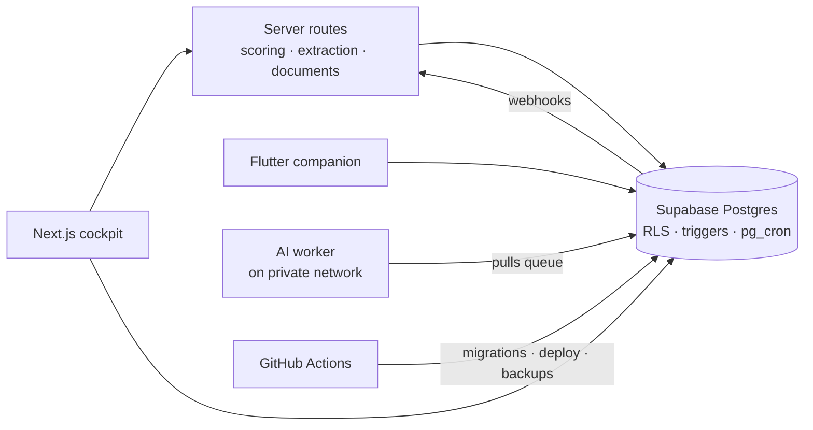

# CareerOps

**Career intelligence and execution system: evidence over self-assessment.**

[](https://github.com/kolevmvk/careerops/actions/workflows/ci.yml)
[](https://github.com/kolevmvk/careerops/actions/workflows/security.yml)
[](https://scorecard.dev/viewer/?uri=github.com/kolevmvk/careerops)
[](LICENSE)

CareerOps connects verified capabilities, project evidence, real job-market requirements, target organizations and career documents in one data model. It answers five operational questions:

1. Where am I now?
2. Where am I going?
3. What is missing?
4. What should I do next?
5. Where is my proof worth the most, and on what terms?

A skill level is not a slider. It is backed by releases, deployments, repositories, incidents and work history, and every score shows _why_.

```
verified evidence → skill model → real market demand → explainable gaps
→ evidence-producing roadmap → targeted documents → opportunities → outcome feedback
```

## Status

| Phase                         | Scope                                                        | Status          |
| ----------------------------- | ------------------------------------------------------------ | --------------- |
| 0 · Foundation                | Repository, CI/CD, security scanning, ADRs                   | **in progress** |
| 1 · Data                      | Postgres schema, RLS, invariants, pgTAP tests, demo seed     | planned         |
| 2 · Proof                     | Career history, skills, evidence, projects                   | planned         |
| 3 · Market                    | Job import, extraction, scoring snapshots                    | planned         |
| 4 · Opportunities & documents | Organizations, pipeline, terms gate, CV and pitch generation | planned         |
| 5 · Execution                 | Roadmap, tasks, learning                                     | planned         |
| 6 · Platform                  | Terraform, backups and restore drills, observability         | planned         |
| 7–9                           | Android companion, AI worker, public demo                    | planned         |

Progress is tracked in [milestones](https://github.com/kolevmvk/careerops/milestones).

## Architecture



Key decisions are recorded as [Architecture Decision Records](docs/adr/README.md).

## Documentation

| Document                               | Contents                                               |
| -------------------------------------- | ------------------------------------------------------ |
| [Specification](docs/SPECIFICATION.md) | Product scope, architecture, security, phases          |
| [Domain model](docs/DOMAIN.md)         | Entities, invariants, visibility and disclosure model  |
| [Scoring](docs/SCORING.md)             | Deterministic, versioned formulas with worked examples |
| [Environments](docs/ENVIRONMENTS.md)   | Local, staging and production                          |
| [Operations](docs/OPERATIONS.md)       | Runbooks                                               |
| [Contributing](CONTRIBUTING.md)        | Branching model, commits, pull requests                |
| [Security](SECURITY.md)                | Vulnerability reporting and data policy                |

## Engineering practices

- **Branching:** `main` is production and `develop` is integration. Work happens on `feature/*` branches merged through pull requests with required checks.
- **Releases:** Conventional Commits, SemVer, and changelogs generated by release-please.
- **Supply chain:** GitHub Actions pinned to commit SHAs, Dependabot, dependency review, OpenSSF Scorecard.
- **Security:** CodeQL, gitleaks on full history, secret scanning with push protection, row-level security tested in CI.
- **Privacy:** public code, private data. The repository contains a fictional demo persona only.

## Repository layout

```
apps/        web cockpit, mobile companion        (from phase 2)
packages/    scoring, extraction, documents, ai   (pure TypeScript)
services/    ai-worker                            (phase 8)
supabase/    migrations, pgTAP tests, demo seed   (phase 1)
infra/       Terraform                            (phase 6)
docs/        specification, domain, scoring, ADRs
```

## Getting started

Requirements: Node.js 22.12+ with pnpm 9. The repository pins Node 24 through `.npmrc`, so pnpm fetches it automatically.

```bash
pnpm install
pnpm check      # format, lint, typecheck, test
```

## License

Copyright © 2026 Milan Kolev. All rights reserved. Published for evaluation and portfolio review; see [LICENSE](LICENSE).
