# CareerOps — Domain Model

Status: draft for v0.1 · Supersedes section 5 and 19 of Specification v1.0 · Companion documents: [SPECIFICATION.md](SPECIFICATION.md), [SCORING.md](SCORING.md)

The domain is designed before the UI. This document is the contract that the database schema, the scoring package, the web cockpit and the mobile companion all depend on.

---

## 1. The model in one paragraph

A person has a **career history** (employments, education, credentials) and **projects**. Both produce **evidence**. Evidence is linked to entries in a **skill catalog** with a strength and a demonstrated level. The person's **skill state** (assessed level, target) is separate from the catalog. **Jobs** are imported and decomposed into **requirements** that point into the same catalog, grouped by **target role**. The scoring package compares requirements against evidence-backed skill state and stores versioned **snapshots** (job matches, skill scores, readiness). Gaps become **roadmap items** and **tasks** whose definition of done is new evidence. **Organizations** are researched as targets in their own right, not only as names on job ads. Every pursuit (job application or direct outreach for employment, contract or consulting work) is an **opportunity** with an origin, a pitch angle, the proof it leverages, and expected versus offered **terms**. Organizations are ranked by how directly they need what already exists. **Documents** (CV, LinkedIn profile, case study, pitch, article, cover letter) are generated only from verified, sufficiently visible facts and are frozen when sent in an opportunity.

```
career history + projects ─► evidence ─► skill catalog ◄─ job requirements ◄─ jobs ◄─ target roles
                                  │            │                                  │
                                  ▼            ▼                                  ▼
                              documents    skill state ─► scoring snapshots ─► roadmap / tasks
                                  │                                               │
                                  └────────► opportunities ◄── organizations ◄────┘
                                              (job ad or outreach · proof · terms)
```

---

## 2. Design decisions that shape everything

These are expensive to change later and are recorded as ADRs.

| # | Decision | Rationale |
|---|---|---|
| D1 | **Skill catalog is separate from skill state.** `skills` describes *what a skill is*; `user_skills` describes *where I am with it*. | Jobs require skills the user does not track yet. Those are exactly the gaps. A user-scoped skill table cannot represent them without creating fake state. |
| D2 | **Two-level skill hierarchy** (`skills.parent_id`, max depth 2) and a **skill kind** (`technology`, `platform`, `language`, `practice`, `domain`). | Job ads mix granularity ("AWS" vs "IAM", "EKS"). Practices such as *Release Engineering* or *Threat Modeling* are what transfer from complex product work into Ops/Security roles. |
| D3 | **Derived values are never hand-maintained columns.** Evidence confidence, market frequency, gap priority and readiness live in versioned snapshot tables produced by the scoring package. | Prevents stale numbers and makes historical scores explainable. |
| D4 | **One visibility model with a disclosure ceiling** (§5). | Employer-owned products and sensitive employment need a second authority besides the user. |
| D5 | **Documents are one concept.** CV, cover letter, LinkedIn profile, case study and article share `documents` / `document_versions` / `document_sources`. | Same guardrails, same traceability, same freeze rule; no parallel CV and portfolio engines. |
| D6 | **Job requirements include hard constraints** (language, location, work authorization, clearance, years, certification) in the same table, flagged `is_hard_constraint`. | Constraints are evaluated as a separate gate, not blended into the score, but are extracted and reviewed in the same flow. |
| D7 | **Every row carries `user_id`**, including catalog tables. | One uniform RLS policy. The public demo is a separate Supabase project, not a second tenant. |
| D8 | **Snapshots over recalculation.** Job matches, skill scores and readiness are append-only with `scoring_version`; the latest row is flagged `is_current`. | Past application decisions remain explainable after formulas change. |
| D9 | **Opportunities replace applications.** One pipeline covers job-ad applications and company-first outreach for employment, contract and consulting work, distinguished by `track` and `origin`. | Strong candidates do not only answer ads. A shipped product lets the candidate approach an organization that needs that capability ("I have already built what you need"). Splitting ads and outreach into two pipelines would split the funnel metrics that show which approach works. |
| D10 | **Terms are first-class data.** Target roles carry a compensation floor; opportunities record expected and offered terms. | "Serious terms" is a decision rule, not a feeling. The system should flag opportunities below the floor before time is invested, and show which tracks produce acceptable offers. |
| D11 | **IP ownership is recorded per project** and feeds the disclosure ceiling. | What may be shown (code, screenshots, metrics, customers) depends on who owns the product. The candidate's role, architecture and decisions can be presented. Owner-controlled material needs approval. |
| D12 | **Competitiveness is evidence too.** `project_benchmarks` records feature-by-feature comparison with commercial products, each row sourced and verified. | "What I built is comparable to products companies pay for" is the strongest employment argument, and also the easiest one to overstate. Structured, sourced rows keep it defensible in an interview. |

---

## 3. Entity overview

Tags: **v0.1** = required for the first usable release, **v0.2** = next, **later** = deferred.

### 3.1 Career history

| Entity | Purpose | Tag |
|---|---|---|
| `profiles` | Identity, headline, location, timezone, remote preference, relocation, work authorization, public slug. One row per user. | v0.1 |
| `employments` | Organization, title, dates, summary. Carries visibility and disclosure. | v0.1 |
| `employment_highlights` | Individual CV-grade claims for an employment. The unit CV bullets are built from. | v0.1 |
| `education` | Institution, program, degree, dates. | v0.1 |
| `credentials` | Certifications: planned → in progress → earned → expired, with verification URL. | v0.1 |
| `languages` | Spoken languages with CEFR level. Needed for hard-constraint checks. | v0.1 |

### 3.2 Skills

| Entity | Purpose | Tag |
|---|---|---|
| `skill_categories` | Linux, Networking, Cloud, DevOps, Security, Programming, Databases, Automation, Mobile, Web, AI/LLM, Product & Delivery, Soft Skills. | v0.1 |
| `skills` | Catalog entry: name, slug, kind, category, optional parent. | v0.1 |
| `skill_aliases` | Synonyms used by deterministic job extraction ("Amazon Web Services" → AWS, "continuous integration" → CI/CD). | v0.1 |
| `user_skills` | Target level, status (`active`, `maintenance`, `deferred`, `archived`), feasibility, notes. | v0.1 |
| `skill_assessments` | Append-only assessed level with method and rationale. The latest row is the current assessed level. | v0.1 |

### 3.3 Projects and evidence

| Entity | Purpose | Tag |
|---|---|---|
| `projects` | Structured case: problem, role, ownership, architecture, result, operational status, links. Optional parent (product families) and optional employment (work context). | v0.1 |
| `project_decisions` | ADR-style record: context, decision, alternatives, consequences. Feeds case studies and interview prep; evidence for design-level capability. | v0.1 |
| `project_benchmarks` | Feature comparison against commercial products: capability, own status, competitor status, sources. Feeds the "comparable to" section of pitches and case studies. | v0.1 |
| `evidence` | A verifiable fact: release, deployment, repository, incident record, design document, lab, certification, article… | v0.1 |
| `evidence_skills` | Link evidence ↔ skill with strength (1–3), demonstrated level (0–5), rationale and confirmation. | v0.1 |

### 3.4 Learning

| Entity | Purpose | Tag |
|---|---|---|
| `learning_resources` | Course, book, lab, certification path; progress and dates. | v0.1 |
| `learning_resource_skills` | Which skills a resource targets and how relevant it is. | v0.1 |

### 3.5 Market

| Entity | Purpose | Tag |
|---|---|---|
| `target_roles` | Named role family with tier, weight, seniority band, compensation floor and positioning note. | v0.1 |
| `organizations` | Target company researched directly: sector, local presence, known systems, relationship types, sources. | v0.1 |
| `jobs` | Imported posting: raw text, source, hashes, parsed metadata, relevance rating. | v0.1 |
| `job_requirements` | Skill requirements and hard constraints extracted from a job. | v0.1 |

### 3.6 Scoring snapshots

| Entity | Purpose | Tag |
|---|---|---|
| `scoring_configs` | Versioned weights and thresholds. Exactly one active. | v0.1 |
| `skill_scores` | Per user skill: effective level, evidence confidence, market frequency, gap type and priority, breakdown. | v0.1 |
| `job_matches` | Per job: score, constraint gate, per-requirement breakdown (JSONB). | v0.1 |
| `readiness_snapshots` | Per target role: readiness score and breakdown. | v0.1 |

### 3.7 Execution

| Entity | Purpose | Tag |
|---|---|---|
| `roadmap_items` | Milestone with horizon (`d90`, `m6`, `target`), definition of done, `requires_evidence`. | v0.1 |
| `roadmap_item_skills` | Skill and level movement the milestone aims for. | v0.1 |
| `roadmap_item_evidence` | Evidence that satisfies the milestone. | v0.1 |
| `tasks` | Concrete action, optionally linked to a skill, job, application, project, learning resource or roadmap item. `is_focus` marks the 3–5 selected actions. | v0.1 |

### 3.8 Documents and opportunities

| Entity | Purpose | Tag |
|---|---|---|
| `documents` | Logical document: kind, language, target role, job, organization or project. | v0.1 |
| `document_versions` | Structured content plus rendered Markdown; `draft` or `frozen`. | v0.1 |
| `document_sources` | Which verified facts a version is built from, per section. | v0.1 |
| `opportunities` | One pursuit: track, organization, optional job, pitch angle, fit, stage, outcome, expected and offered terms, next action. | v0.1 |
| `opportunity_documents` | Frozen document versions sent in an opportunity (CV, pitch, one-pager, cover letter). | v0.1 |
| `opportunity_events` | Stage changes, messages, calls, interviews, proposals, follow-ups. | v0.1 |
| `contacts` | People or role hypotheses at an organization ("Head of Integrations", before a name is known). | v0.1 |

### 3.9 System

| Entity | Purpose | Tag |
|---|---|---|
| `ai_analyses` | Queue and audit record for every AI call. | v0.2 |
| `settings` | Per-user key/value configuration. | v0.1 |
| `audit_log` | Append-only record of visibility changes, freezes and AI-assisted edits. | v0.1 |

### 3.10 Removed from v1.0 and why

| v1.0 table | Replacement |
|---|---|
| `project_skills` | Derived through `evidence.project_id` → `evidence_skills`. A second path would be a second source of truth. |
| `project_evidence` | `evidence.project_id` foreign key. |
| `learning_progress` | `learning_resources.progress_percent` and dates. |
| `job_skills` | `job_requirements` (also covers hard constraints). |
| `job_match_items` | `job_matches.breakdown` JSONB; items are part of an immutable snapshot and are not queried relationally. |
| `roadmaps` | `roadmap_items.horizon`; a single user has one roadmap. |
| `applications`, `application_events` | `opportunities` (track `employment`), `opportunity_events`. |
| `cv_versions`, `cv_sections`, `cv_job_matches` | `documents`, `document_versions`, `document_sources`. |
| `portfolio_projects` | Database view over `projects` and `documents` with effective visibility `portfolio_public`. |

---

## 4. Entity reference

Conventions for all tables: `id uuid primary key default gen_random_uuid()`, `user_id uuid not null references auth.users`, `created_at timestamptz not null default now()`, `updated_at timestamptz` (trigger-maintained). Omitted below unless relevant. Dates that people remember imprecisely use `date` plus `date_precision` (`day`, `month`, `year`).

### 4.1 Career history

**profiles**
```
full_name text · headline text · summary text · location text · timezone text
remote_preference enum(remote, hybrid, onsite, any) · open_to_relocation boolean
work_authorization text[]           -- e.g. {"RS", "EU-visa-required"}
public_slug text unique
```

**employments**
```
organization text                   -- internal, may be precise
public_organization text            -- the name allowed outside private use
title text · public_title text
employment_type enum(full_time, part_time, contract, freelance, military, internship)
start_date date · end_date date null · date_precision
location text · summary text
visibility · disclosure_status · ai_allowed boolean      -- see §5
```

**employment_highlights**
```
employment_id → employments
text text                           -- one claim, written at the abstraction level it may be shown
evidence_id → evidence null         -- the fact that backs the claim, if any
visibility · verified_at timestamptz null · sort_order int
```

**education**: `institution, program, degree, start_date, end_date, date_precision, visibility`.

**credentials**
```
name text · issuer text · status enum(planned, in_progress, earned, expired)
issued_at date null · expires_at date null · credential_url text · credential_id text
visibility · learning_resource_id → learning_resources null
```
An earned credential creates an `evidence` row of type `certification`.

**languages**: `language text (ISO 639-1), proficiency enum(A1..C2, native)`.

### 4.2 Skills

**skills**
```
name text · slug text unique per user · kind enum(technology, platform, language, practice, domain)
category_id → skill_categories · parent_id → skills null · description text
```
Invariants: depth ≤ 2; no cycles; a parent's kind need not match its children.

**skill_aliases**: `skill_id, alias text, normalized text unique per user`.
Normalization: lowercase, strip punctuation, collapse whitespace. The extraction package matches on `normalized`.

**user_skills**
```
skill_id → skills unique per user
target_level smallint null check 0..5   -- manual override; otherwise derived from target-role demand
status enum(active, maintenance, deferred, archived)
feasibility enum(low, medium, high) default medium
notes text
```

**skill_assessments** (append-only)
```
user_skill_id → user_skills
assessed_level smallint check 0..5
method enum(self, evidence_review, interview_feedback, certification_exam, external_review)
rationale text not null
assessed_at timestamptz
```

Skill levels (ordinal, never a percentage):

| Level | Definition |
|---|---|
| 0 | No usable knowledge. |
| 1 | Understands fundamentals and terminology. |
| 2 | Can perform basic tasks with documentation. |
| 3 | Uses the skill independently in practical work. |
| 4 | Production-level experience; troubleshoots non-trivial problems. |
| 5 | Designs and debugs complex systems; can lead others in the area. |

### 4.3 Projects and evidence

**projects**
```
name text · slug text · parent_project_id → projects null
employment_id → employments null     -- null = independent project
kind enum(product, client_work, internal_tool, lab, infrastructure)
role text · ownership enum(sole, lead, core_contributor, contributor)
problem text · constraints text · solution text · architecture_md text · result text
operational_status enum(concept, prototype, production, maintained, retired)
started_at date · ended_at date null · date_precision
ip_owner enum(self, employer, client, shared, unclear)
code_visibility enum(public, private, employer_owned)
repo_url text · live_url text · store_urls jsonb
visibility · disclosure_status · ai_allowed
```
`parent_project_id` models product families. Example: a *Tempus platform* parent with *Tempus* (mobile app) and *Terminal* (shared tablet endpoint) as children. Evidence can attach to the parent (integration, release process) or a child (specific client behavior).

`ip_owner ∈ {employer, client, unclear}` forces `disclosure_status` to at least `approval_required`, so code, metrics, customers and screenshots stay out of documents until approved.

**project_benchmarks**
```
project_id → projects
capability text                        -- e.g. "offline capture with later synchronization"
own_status enum(implemented, partial, planned, absent)
own_evidence_id → evidence null        -- the fact that proves own_status
competitor text · competitor_status enum(yes, partial, no, unknown)
competitor_source_url text · checked_at date
note text · visibility
```
A benchmark row may appear in a document only when `own_status` is backed by verified evidence and the competitor column has a source checked within 180 days (invariant I12). Honest `absent` rows stay in the table: they show where the product is a capture layer and not a full suite, which makes the positive rows credible.

**project_decisions**
```
project_id → projects
title text · context text · decision text · alternatives text · consequences text
decided_at date null · visibility
```

**evidence**
```
type enum(
  production_deployment, release, work_experience, repository, pull_request,
  incident_record, design_document, lab, certification, documentation,
  demo_url, article, course_completion
)
title text · description text
project_id → projects null · employment_id → employments null
learning_resource_id → learning_resources null
url text · storage_path text          -- private bucket unless effective visibility is portfolio_public
occurred_from date · occurred_to date null   -- null = ongoing; drives recency
source enum(manual, import, ai_suggested)
verified_at timestamptz null          -- the user confirms the fact is true and accurately described
visibility · ai_allowed
```

**evidence_skills**
```
evidence_id → evidence · skill_id → skills   unique pair
strength smallint check 1..3          -- 1 supporting, 2 substantial, 3 primary
demonstrated_level smallint check 0..5 null
rationale text
suggested_by enum(user, ai, rule)
confirmed_at timestamptz null         -- mapping accepted by the user
```
Human input stays ordinal (1–3, 0–5); the scoring package maps it to numbers.

### 4.4 Learning

**learning_resources**
```
title · provider · type enum(course, book, lab, certification_path, path)
url · status enum(planned, active, paused, completed, dropped)
progress_percent smallint check 0..100 · started_at · completed_at · notes
```
**learning_resource_skills**: `learning_resource_id, skill_id, relevance smallint 1..3`.

Completing a resource with `relevance = 3` for an active gap creates a task: *produce an evidence artifact*.

### 4.5 Market

**target_roles**
```
name text · family enum(systems, linux, network, infrastructure, cloud, devops, security, support, other)
tier enum(primary, bridge, stretch, fallback)
weight numeric check 0..1 · seniority_band text · status enum(active, paused)
positioning_note text
comp_floor numeric null · comp_currency text · comp_period enum(month, year)
comp_basis enum(gross, net, b2b_invoice)
accepted_contract_types text[]         -- {employment, b2b_contract, freelance}
```

**organizations**
```
name text · origin_country text · sector text
local_presence text                    -- sites, cities, scale as publicly reported, with date
known_systems text                     -- e.g. "ERP documents integration with external attendance systems"
need_hypothesis text                   -- what they need that the candidate has already built
need_signals text[]                    -- observable signals: open roles, product gaps, documented integrations
employer_tier enum(a_builds_same_domain, b_same_engineering_problems, c_operates_the_problem) null
source_urls text[] · researched_at date
notes text · visibility default private
```
Research claims about an organization are dated and sourced. Headcounts and vendor facts go stale; `researched_at` makes that visible.

**jobs**
```
target_role_id → target_roles null · organization_id → organizations null
company · title · location · remote_policy enum(remote, hybrid, onsite, unknown)
seniority text · employment_type text
salary_min numeric null · salary_max numeric null · salary_currency text null
source_kind enum(paste, url_fetch, ats_api, share_intent, bookmarklet)
source_url text · raw_text text not null
url_hash text · content_hash text      -- unique per user on content_hash
language text · posted_at date null · imported_at timestamptz
parser_version text · status enum(new, parsed, reviewed, archived)
relevance smallint check 0..2          -- 0 noise, 1 relevant, 2 benchmark
```

**job_requirements**
```
job_id → jobs
kind enum(skill, certification, language, location, work_authorization, clearance, experience_years, education)
skill_id → skills null                 -- null when kind ≠ skill or still unmapped
raw_text text not null                 -- the phrase as it appeared
importance enum(required, preferred)
required_level smallint null check 0..5
years numeric null
is_hard_constraint boolean
mapping_status enum(auto, confirmed, unmapped, ignored)
extracted_by enum(dictionary, ai, manual)
```
Unmapped phrases are never discarded; they appear in a review queue and can become new `skills` or `skill_aliases`.

### 4.6 Scoring snapshots

All snapshot tables carry `scoring_version text`, `scoring_config_id`, `computed_at`, `is_current boolean`, `breakdown jsonb`. Only one row per subject has `is_current = true`.

- **skill_scores**: `user_skill_id, target_role_id null, assessed_level, supported_level, effective_level, evidence_confidence, market_frequency, target_level, gap_type enum(none, prove, learn), gap_priority`.
- **job_matches**: `job_id, score, constraint_gate enum(pass, warn, fail, unknown)`.
- **readiness_snapshots**: `target_role_id, score, sample_size, sufficient_data boolean`.

Formulas: [SCORING.md](SCORING.md).

### 4.7 Execution

**roadmap_items**
```
title · description · horizon enum(d90, m6, target)
target_role_id → target_roles null
status enum(planned, active, done, dropped) · due_date date null
definition_of_done jsonb               -- [{ "text": "...", "done": false }]
requires_evidence boolean default true
```
**roadmap_item_skills**: `roadmap_item_id, skill_id, from_level, to_level`.
**roadmap_item_evidence**: `roadmap_item_id, evidence_id`.

**tasks**
```
title · notes · status enum(todo, doing, done, dropped) · due_date · is_focus boolean
skill_id null · job_id null · application_id null · project_id null
learning_resource_id null · roadmap_item_id null
```

### 4.8 Documents and applications

**documents**
```
kind enum(cv, cover_letter, linkedin_profile, case_study, pitch, one_pager, integration_brief, article)
title · language text default 'en'
target_role_id → target_roles null · job_id → jobs null
organization_id → organizations null · project_id → projects null
```
`pitch` is a short outreach message; `one_pager` and `integration_brief` are the artifacts that change how a reader classifies the work (for example, "attendance app" versus "workforce edge gateway").

**document_versions**
```
document_id → documents · version int
content jsonb                          -- structured sections
rendered_md text
status enum(draft, frozen) · frozen_at timestamptz null
generator enum(manual, template, ai_assisted)
ai_analysis_id → ai_analyses null
```

**document_sources**
```
document_version_id → document_versions · section text
employment_id null · employment_highlight_id null · project_id null · project_decision_id null
project_benchmark_id null
evidence_id null · credential_id null · education_id null
check (num_nonnulls(...) = 1)
```

**opportunities**
```
track enum(employment, contract, consulting)
origin enum(job_ad, outreach, referral, inbound)
organization_id → organizations null · job_id → jobs null · target_role_id → target_roles null
project_id → projects null             -- the proof being leveraged, e.g. a shipped product
title text · angle text                -- why this organization, why this proof
fit smallint check 1..5 · receptiveness smallint check 1..5
stage enum(identified, researched, contacted, conversation, evaluation, negotiation, closed)
outcome enum(open, won, declined_by_me, rejected, withdrawn, no_response, parked)
job_match_id → job_matches null
expected_comp numeric null · offered_comp numeric null
comp_currency text · comp_period enum(month, year) · comp_basis enum(gross, net, b2b_invoice)
contract_type enum(employment, b2b_contract, freelance) null
remote_policy enum(remote, hybrid, onsite, unknown)
terms_notes text
first_contact_at timestamptz null · next_action text · next_action_due date null
```
Stage and outcome are separate: rejection can happen at any stage, and the stage it happened at is what the funnel metrics need. For job ads, `contacted` means applied and `evaluation` covers screening, technical and final interviews, recorded as typed events.

**opportunity_documents**: `opportunity_id, document_version_id, role enum(cv, cover_letter, pitch, one_pager, integration_brief, case_study), sent_at`.

**opportunity_events**
```
opportunity_id · type enum(stage_change, message_sent, message_received, call, interview, proposal, offer, follow_up, note)
interview_kind enum(screening, technical, hiring_manager, final) null
from_stage · to_stage · occurred_at · note
```

**contacts**
```
organization_id → organizations
name text null · title text · is_role_hypothesis boolean   -- true until a real person is identified
channel enum(linkedin, email, phone, event, referral) · profile_url text · notes text
```
Contacts about real people are always `private` and never sent to AI providers.

### 4.9 System

**ai_analyses**
```
kind enum(job_extraction, alias_suggestion, evidence_mapping, highlight_drafting, match_explanation, roadmap_suggestion)
provider text · model text · prompt_version text
input_refs jsonb                       -- ids only, never raw sensitive text
output jsonb · status enum(pending, running, succeeded, failed)
decision enum(accepted, partially_accepted, rejected) null
error text · latency_ms int · requested_at · completed_at
```
The table doubles as the work queue for the local AI worker (see Specification §9).

**audit_log** (append-only): `entity text, entity_id uuid, action text, changed_fields text[], actor enum(user, system, ai_worker), details jsonb, created_at`.

---

## 5. Visibility and disclosure

### 5.1 Levels

Visibility is an **ordered** enum. A higher level implies the lower ones.

| Level | May appear in | Never appears in |
|---|---|---|
| `private` | The cockpit only. | Any document, export, AI request (unless `ai_allowed`), public view. |
| `cv_safe` | CV, cover letter, LinkedIn profile, applications shared with recruiters. | Portfolio site, case studies, articles, public demo, public repository. |
| `portfolio_public` | Everything above, plus portfolio site, case studies and articles. | — |

LinkedIn is treated as `cv_safe`: it is professional disclosure written at CV abstraction level, not a place for technical depth that belongs in a case study.

### 5.2 Disclosure ceiling

The user decides visibility. Some facts also belong to a third party (an employer, a client, a defense organization). `disclosure_status` records that party's position and caps the effective visibility.

| `disclosure_status` | Meaning | Ceiling |
|---|---|---|
| `not_required` | The user owns the facts. | `portfolio_public` |
| `approval_required` | Details, metrics, screenshots or customer names need owner approval that has not been given yet. | `cv_safe` |
| `approved` | Owner approved public use (record who and when in `audit_log`). | `portfolio_public` |
| `restricted` | Only an abstraction may ever leave the system. | `cv_safe`, and `ai_allowed` forced to `false` |

```
effective_visibility(row) = min(row.visibility,
                                ceiling(row.disclosure_status),
                                effective_visibility(parent employment or project))
```

### 5.3 Rules for sensitive employment

For `restricted` employments the database stores **only the abstraction**. Unit names, system names, topologies, locations, capacities, IP ranges and procedures are never entered, not even as `private`. Filtering at read time is a second line of defense, not the first.

---

## 6. Invariants

Enforced in Postgres (constraint, trigger or RLS) unless marked *app*.

| ID | Invariant | Enforcement |
|---|---|---|
| I1 | Effective visibility never exceeds the disclosure ceiling or the parent's effective visibility. | Trigger on write to `employments`, `projects`, `evidence`, `employment_highlights`, `project_decisions`. |
| I2 | A `frozen` document version cannot be updated or deleted. | Trigger. |
| I3 | Linking a document version to an opportunity freezes it. | Trigger on `opportunity_documents`. |
| I4 | Every `document_sources` row references a verified fact whose effective visibility meets the document kind's minimum (`cv_safe` for cv, cover_letter, linkedin_profile, pitch, one_pager, integration_brief; `portfolio_public` for case_study, article). | Trigger. |
| I5 | Unverified evidence and unconfirmed `evidence_skills` are excluded from scoring and documents. | Scoring input views filter on `verified_at` and `confirmed_at`. |
| I6 | AI inputs are built only from views that exclude `ai_allowed = false`. | `ai_context_*` views; the worker role has no grant on base tables. |
| I7 | A roadmap item with `requires_evidence` cannot become `done` without at least one verified linked evidence row. | Trigger. |
| I8 | Snapshots always carry `scoring_version` and `scoring_config_id`; exactly one `is_current` per subject. | Not-null + partial unique index. |
| I9 | Skill hierarchy depth ≤ 2 and acyclic. | Trigger. |
| I10 | `audit_log` and `skill_assessments` are append-only. | No UPDATE/DELETE RLS policies. |
| I11 | At most five tasks have `is_focus = true`. | *app*, soft limit with warning. |
| I12 | A `project_benchmarks` row can be a document source only if `own_evidence_id` is verified and `checked_at` is within 180 days. | Trigger on `document_sources`. |
| I13 | An opportunity whose expected or offered compensation is below the linked target role's floor (same currency, period and basis) is flagged before `contacted`. | *app*, warning with explicit override. |

---

## 7. Entity-relationship diagram (core)

```mermaid
erDiagram
    employments ||--o{ employment_highlights : has
    employments ||--o{ projects : "context for"
    projects ||--o{ projects : "parent of"
    projects ||--o{ project_decisions : records
    projects ||--o{ project_benchmarks : "compared in"
    projects ||--o{ evidence : produces
    employments ||--o{ evidence : produces
    learning_resources ||--o{ evidence : produces
    evidence ||--o{ evidence_skills : supports
    skills ||--o{ evidence_skills : "supported by"
    skills ||--o{ skills : "parent of"
    skills ||--o{ skill_aliases : "known as"
    skills ||--o| user_skills : "tracked as"
    user_skills ||--o{ skill_assessments : "assessed by"
    user_skills ||--o{ skill_scores : "scored as"
    target_roles ||--o{ jobs : groups
    jobs ||--o{ job_requirements : requires
    skills ||--o{ job_requirements : "required in"
    jobs ||--o{ job_matches : "scored as"
    target_roles ||--o{ readiness_snapshots : "scored as"
    roadmap_items ||--o{ tasks : "broken into"
    roadmap_items ||--o{ roadmap_item_evidence : "done when"
    evidence ||--o{ roadmap_item_evidence : satisfies
    documents ||--o{ document_versions : versions
    document_versions ||--o{ document_sources : "built from"
    organizations ||--o{ jobs : posts
    organizations ||--o{ contacts : employs
    organizations ||--o{ opportunities : "pursued in"
    jobs ||--o{ opportunities : "origin of"
    projects ||--o{ opportunities : "proof for"
    opportunities ||--o{ opportunity_documents : sends
    document_versions ||--o{ opportunity_documents : "sent as"
    opportunities ||--o{ opportunity_events : logs
```



---

## 8. Worked example: a shipped field-workforce product used as proof

This example is the acceptance test for the model. If it cannot be represented cleanly, the model is wrong.

**Situation.** A workforce attendance platform: a cross-platform mobile app (*Tempus*), a dedicated Android endpoint for shared check-in (*Terminal*), and integration with an existing business backend. Attendance is verified through QR, GPS, biometrics and Bluetooth beacons. The builder handled Android production releases, Play Console compliance, multilingual releases, iOS distribution and production troubleshooting. Metrics, customer names and screenshots need approval. IP ownership is not yet recorded.

Architecturally the product is a **workforce edge layer** rather than an HR application:

```
employee → mobile app / Android terminal
         → identity + timestamp + site + method + device
         → QR | GPS / geofence | beacon | biometric (optional)
         → offline queue → validation → synchronization
         → workforce API → existing HR / payroll / ERP (system of record)
```

**Representation.**

```
employments   (employer) · disclosure_status = approval_required
projects      Tempus platform   parent · kind=product · ip_owner=unclear · code_visibility=employer_owned
              ├─ Tempus         child: mobile client
              └─ Terminal       child: shared-device Android endpoint
project_decisions
              "Which verification signal for which context: QR vs GPS/geofence vs beacon vs biometrics"
              "Commodity Android endpoint instead of proprietary clocking hardware"
              "Capture layer that feeds the existing HR system instead of replacing it"
evidence      (each row: verified_at = null until confirmed)
              release                Android production releases     → Release Engineering, Flutter
              release                iOS distribution                → Release Engineering
              design_document        verification signal trade-offs  → Identity & Authentication, Threat Modeling
              design_document        event model and sync design     → Offline Sync & Idempotency, Event-driven Design
              work_experience        backend / API integration       → API Integration, Integration Architecture
              production_deployment  terminals in real use           → Endpoint / Kiosk Management
              incident_record        production troubleshooting      → Incident Response, Observability
project_benchmarks
              mobile registration · Android terminal · geofence · beacon · offline sync · REST API
                → own_status per verified evidence, compared with public feature lists of commercial products
              scheduling · absences · payroll calculation
                → own_status = absent (capture layer, not an HR suite)
organizations
              tier A: a vendor that builds attendance or ERP/payroll software and documents integrations
                      with external attendance systems   need_hypothesis: "in-house mobile and terminal capture layer"
              tier B: an engineering organization solving device-to-enterprise problems in field service
opportunities
              track=employment  origin=outreach  organization=tier A  project=Tempus platform
                angle: "I have already built the capture layer your product integrates from outside"
              track=employment  origin=job_ad    organization=tier B  project=Tempus platform
                angle: "edge-to-enterprise engineering: devices, offline sync, identity, integration"
```

**What the model gives back.**

- Skill *kinds* keep the technology signal (Flutter, Dart) separate from **transferable practices**: Release Engineering, Identity & Authentication, Offline Sync & Idempotency, Integration Architecture, Endpoint Management, Incident Response. These score for Infrastructure, Cloud, DevOps, Security and integration roles even when Flutter itself is in `maintenance`.
- `demonstrated_level` on the links lets design-level work register as level 4–5 instead of being flattened to "used Flutter".
- The disclosure ceiling keeps metrics, screenshots and customer names at `cv_safe` until approval. Only then can a case study reach `portfolio_public`.
- `project_decisions` become the "difficult decisions" section of the case study, the integration brief and interview material, all drawn from the same verified facts as the CV.
- `project_benchmarks` turns "comparable to commercial products" into a table an interviewer can check, including the honest gaps.
- Organizations are ranked by how directly they need what already exists, so outreach starts where the proof is worth the most.

Every evidence row above is a placeholder to confirm and verify. Nothing here is seeded as fact.
