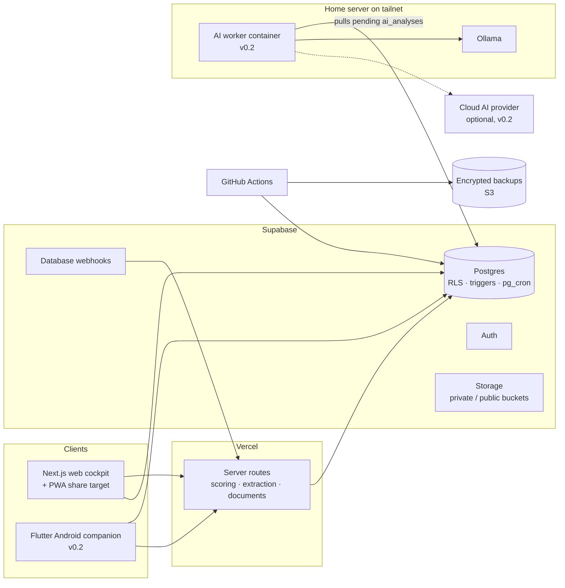

# CareerOps — Project Specification v1.1

**Personal career intelligence and execution system**

Status: architecture and implementation blueprint · Date: 2026-09-15 · Supersedes: v1.0 (PDF, same date)
Detailed contracts: [DOMAIN.md](DOMAIN.md) (entities, invariants) · [SCORING.md](SCORING.md) (formulas)

---

## 0. What changed from v1.0

v1.0 was reviewed against its own review brief (section 31) and against two further inputs: a professional positioning plan and market research on a shipped workforce product. The main changes:

| Area | v1.0 | v1.1 | Why |
|---|---|---|---|
| Career strategy | Job-ad driven only | **Job ads and company-first outreach** in one opportunity pipeline (employment, contract, consulting); organizations ranked by how directly they need what the candidate has already built | The strongest position is not "I am transitioning". It is "I have already built what you need." |
| Competitiveness | Not modeled | `project_benchmarks`: sourced, feature-by-feature comparison with commercial products, including honest gaps | Shows that the work competes with products companies pay for, in a form an interviewer can check. |
| Terms | Not modeled | Compensation floor per target role, expected and offered terms per opportunity, terms gate | Serious terms are a decision rule, not an afterthought. |
| Complex product experience | Seed row "Flutter, maintenance" | Product families, IP ownership, design decisions, **transferable practices** as skill kinds | Release engineering, device identity, offline sync and integration work transfer to Infra, Cloud, DevOps and Security roles. |
| Skills | User-scoped table with stored derived scores | Catalog (`skills`, aliases, 2-level hierarchy) separate from user state; derived values only in versioned snapshots | Jobs require skills the user does not track yet, and ads mix granularity. |
| Scoring | Multiplicative formulas, no required level, capability × confidence | Required level, noisy-OR confidence, additive gap priority, hard constraints as a separate gate | Explainable, tunable, and no double penalties. |
| Visibility | Enum on evidence | Ordered visibility plus a **disclosure ceiling** (employer or third-party approval), inherited from parents | Employer-owned and sensitive work needs a second authority. |
| Documents | Separate CV and portfolio engines | One document model: CV, cover letter, LinkedIn profile, case study, pitch, one-pager, integration brief, article | Same guardrails and freeze rule everywhere. |
| Schema | ~27 tables with duplicate paths | Duplicate paths removed; career history (employments, education, credentials, languages) added | CV guardrails need a canonical employment history. |
| n8n | Automation layer in MVP | **Removed from v0.1**; Postgres triggers, `pg_cron`, database webhooks and API routes | One less service to host, secure and back up, and core logic stays in code. |
| Local AI | Called from backend over Tailscale | **Pull-model worker** on the local machine consumes a queue | Vercel and Supabase functions are not on the tailnet. |
| Android | In v0.1 | **v0.2**; v0.1 gets a PWA share target for quick capture | Keeps v0.1 finishable; the companion follows once the data model is stable. |
| Public repository | Real seed data in `seed.sql` | **Public code, private data**: demo persona seed in the repo, real data only in Supabase and encrypted backups | The repository is portfolio evidence and must never leak career data. |

---

## 1. Summary

CareerOps is a private, single-user career operating system. It connects verified capabilities, project evidence, learning, target roles, real job requirements, target organizations, opportunities and career documents in one data model.

It continuously answers five questions:
1. Where am I now?
2. Where am I going?
3. What is missing?
4. What should I do next?
5. **Where is my proof worth the most, and on what terms?**

**Central principle: evidence over self-assessment.** A skill level is backed by releases, deployments, repositories, work history, incidents, labs and certifications. Learning has limited value until it produces evidence.

**Core success criterion.** Given a job ad *or* a target organization, CareerOps explains the fit, identifies high-value gaps, connects existing evidence, recommends the next practical work, and generates a truthful, targeted CV or pitch without inventing experience.

### 1.1 Product thesis

```
canonical profile → verified evidence → skill model → real market demand (ads + organizations)
→ explainable gaps → roadmap → projects and labs → stronger evidence
→ targeted documents → opportunities → outcome and terms feedback
```

If this loop works, automation is useful. If it does not, scraping, agents and visual polish only automate a weak model.

---

## 2. Principles

- **Single source of truth.** Supabase Postgres holds canonical career data for web, mobile, documents and portfolio.
- **Evidence first.** Claims are traceable to verified evidence.
- **Market-driven.** Priorities follow recurring requirements in real target jobs and the response of real organizations.
- **Proof is leverage.** Shipped products are modeled as reusable proof across tracks, not as one CV line.
- **Terms are explicit.** Every opportunity is checked against a floor before time is invested.
- **Deterministic core, optional AI.** The product works with AI disabled. AI suggests; the user confirms.
- **Human-controlled truth.** AI never silently changes factual career history.
- **Privacy by design.** Visibility is ordered (`private` < `cv_safe` < `portfolio_public`) and capped by third-party disclosure.
- **Public code, private data.** The repository is public; career data never enters it.
- **Action-oriented UI.** Dashboards drive the next 3–5 actions, not decorative analytics.
- **Progressive complexity.** Manual import and deterministic rules first; automation only after the model proves useful.

---

## 3. Positioning model

The goal is employment on serious terms, from the position of someone who has already built what the employer needs. The system is built around **proof-led positioning**.

1. **Proof first.** A shipped, complex product is decomposed into transferable practices, design decisions and a sourced competitive benchmark.
2. **Organizations by need.** Targets are ranked by how directly they need that proof:

| Employer tier | Description | Why the proof lands |
|---|---|---|
| **A: builds the same domain** | Vendors whose products include, or integrate from outside, the capability already built | The hiring manager recognizes the problem in the first minute |
| **B: same engineering problems** | Integrators and engineering organizations dealing with devices, identity, offline operation and enterprise integration | The proof transfers with one sentence of explanation |
| **C: operates the problem** | Enterprises whose internal IT runs the kind of system that was built | Relevant for matching vacancies only |

3. **Two positioning axes, one primary.** The primary axis is set by where the proof is strongest. The supporting axis (for example, long infrastructure and operations experience) differentiates within it and remains a separate track for job ads. Funnel metrics per axis (SCORING §9.1) confirm or correct the choice.
4. **Employment framing.** The candidate is hired for the ability to build and run such systems. Nothing in the outreach suggests selling a product. Product thinking such as pricing hypotheses or scope may be discussed as context.

Concrete target roles, weights, compensation floors and organization lists are **data** in the private instance, not part of this public specification.

---

## 4. Scope

### 4.1 v0.1: the first usable system

- Authentication (single user, sign-ups disabled, MFA) and profile
- Career history: employments, highlights, education, credentials, languages
- Skill catalog with aliases and hierarchy; user skill state and assessments
- Projects (product families, IP ownership, decisions, competitive benchmarks) and evidence with visibility and disclosure
- Target roles with compensation floors
- Job import by paste or URL, deterministic requirement extraction, review queue for unmapped phrases
- Scoring snapshots: effective level, confidence, market frequency, job match with constraint gate, gap priority, readiness
- Organizations with need hypothesis, need signals and employer tier; contacts (including role hypotheses)
- Opportunities (job ad or outreach) with events, terms and terms gate
- Documents from verified facts via templates: CV, LinkedIn profile, case study, pitch, one-pager, integration brief; frozen when sent
- Roadmap items with evidence-based definition of done; tasks with focus selection
- Learning resources linked to skills
- PWA share target for quick capture of jobs, evidence and notes from a phone
- RLS on every table, audit log, encrypted backups with a tested restore

### 4.2 v0.2

- Flutter Android companion (§12)
- AI provider interface, local Ollama worker, optional cloud provider (§9)
- ATS adapters (Greenhouse, Lever, Ashby, Workable public job APIs)
- Public portfolio site and public demo instance
- Funnel dashboards per track

### 4.3 Later

- Browser extension or bookmarklet capture from logged-in job boards
- Recommendation beyond deterministic gap priority, once there is enough job and outcome data
- Offline-first mobile synchronization

### 4.4 Non-goals

- Multi-user SaaS or team features
- Automatic application or outreach submission
- Mass scraping or LinkedIn automation
- Gamification
- AI-generated claims that cannot be traced to verified facts
- Storing operational details of restricted employment, even as private data

---

## 5. Architecture



### 5.1 Technology baseline

| Layer | Technology | Note |
|---|---|---|
| Web | Next.js + TypeScript, Tailwind, shadcn/ui | Cockpit and server routes |
| Backend | Supabase (Postgres, Auth, Storage, RLS, webhooks, `pg_cron`) | EU region |
| Domain logic | `packages/scoring`, `packages/extraction`, `packages/documents` (TypeScript, pure) | Single implementation of business rules |
| Mobile | Flutter (v0.2) | Reads snapshots; mutations that need recomputation go through API routes |
| AI | Provider interface; local worker with Ollama over Tailscale; optional cloud provider (v0.2) | Never a hard dependency |
| Hosting | Vercel + Supabase | Low operational burden |
| Infrastructure as code | Terraform (Vercel, Supabase and AWS providers) | Environments, backup bucket, IAM |
| CI/CD | GitHub Actions with OIDC to AWS | No long-lived cloud keys |

### 5.2 Where rules live

| Rule type | Location |
|---|---|
| Integrity, ownership, visibility ceiling, freeze rules, append-only logs | Postgres constraints, triggers, RLS |
| Scoring, extraction, document assembly | TypeScript packages, unit-tested, versioned |
| Orchestration (recompute on change, nightly jobs, follow-up reminders) | Database webhooks, `pg_cron`, API routes |
| Presentation | Clients only |

**Contracts between web and mobile.** The database schema is the contract. TypeScript types come from `supabase gen types`; Dart models are generated from the PostgREST OpenAPI description. Business logic is never ported to Dart. Mobile reads stored results.

---

## 6. Core flows

### 6.1 Evidence

```
capture (web, share target, later mobile)
→ classify type and parent (project, employment, learning)
→ map to skills with strength and demonstrated level (manual, rule or AI suggestion)
→ user verifies the fact and confirms each mapping
→ eligible for scoring
→ optionally raise visibility, up to the disclosure ceiling
```

### 6.2 Job ad

```
paste or URL
→ store raw text, hashes, dedupe
→ deterministic extraction via alias dictionary (skills, levels, constraints)
→ review queue for unmapped phrases (creates aliases or catalog skills)
→ job match snapshot with constraint gate
→ market frequency and gap priority update
→ opportunity (origin = job_ad) if worth pursuing
```

### 6.3 Company-first outreach

```
organization research (products, known integrations, open roles, sources, date)
→ need hypothesis + employer tier: what do they need that already exists?
→ opportunity: angle, fit, receptiveness, proof project, contacts or role hypotheses
→ terms gate against the target role floor
→ company-specific paragraph + pitch or one-pager, from verified cv_safe facts and benchmark rows
→ document versions frozen on send
→ events: messages, calls, interviews, demo, offer
→ outcome and terms feed funnel metrics per axis and origin
```

A company-specific paragraph is mandatory for outreach documents. Sending the same letter to many organizations throws away most of the advantage that specific proof provides.

Research claims about organizations (headcounts, products, vendors used, open roles) are dated and sourced, and they are re-checked before outreach. The system does not treat third-party research as fact.

### 6.4 Documents

```
target (role, job, organization or project)
→ select verified facts meeting the kind's visibility minimum
→ template assembly (v0.1), AI-assisted wording (v0.2) with per-sentence source references
→ user review
→ freeze on send
```

### 6.5 Roadmap

```
high-value gaps and `prove` gaps
→ roadmap item with evidence-producing definition of done
→ tasks, with 3–5 selected as focus
→ evidence linked
→ item can be marked done (invariant I7)
```

---

## 7. Job ingestion

- **Paste** is the primary path and always works.
- **URL**: store the link and try a server-side fetch with readability extraction. On failure (dynamic page, block, login wall) ask for a paste. No crawling and no retries against blocks.
- **Share intent**: from a phone browser to the PWA share target (v0.1) or the Android app (v0.2).
- **ATS adapters** (v0.2): public job-board APIs of common applicant tracking systems return structured postings legally and reliably.
- **Deduplication**: `url_hash` and normalized `content_hash`.
- **Corpus first**: start collecting real target ads from week one, even as raw text. By the time extraction exists there should be 20–30 real fixtures, and market analysis needs them anyway.

---

## 8. Document guardrails

- Never invent employers, dates, titles, responsibilities, certifications, metrics, customers or scale.
- Only verified facts at or above the kind's visibility minimum (DOMAIN I4).
- Every generated sentence keeps source references; a validator rejects numbers, dates and proper names not present in the sources.
- Versions freeze when sent; each opportunity records exactly which versions were sent.
- Third-party estimates (market sizing, valuations, replacement cost, hiring probabilities) are context for decisions and are never presented as facts about the candidate's work.
- Competitive comparisons come only from `project_benchmarks` rows with verified own evidence and a recently checked source (DOMAIN I12). Rows marked `absent` stay visible to the user so that claims do not drift into "better than" without proof.
- The origin of the work (employer, client or independent) is stated as recorded in `projects.ip_owner`, never upgraded to "independent" for convenience.
- Restricted employment appears only as its stored abstraction.

---

## 9. AI layer (v0.2)

### 9.1 Interface

```ts
interface AIProvider {
  extractJobRequirements(input: JobText): Promise<RequirementSuggestion[]>;
  suggestAliases(input: UnmappedPhrase[]): Promise<AliasSuggestion[]>;
  suggestEvidenceMappings(input: EvidenceSummary): Promise<MappingSuggestion[]>;
  draftHighlights(input: VerifiedFacts): Promise<DraftWithSources>;
  explainScore(input: ScoreBreakdown): Promise<string>;
}
```

All outputs are validated against JSON schemas and the skill catalog before they are shown.

### 9.2 Local worker (pull model)

Vercel and Supabase functions cannot reach a Tailscale network. The server writes `ai_analyses` rows with `status = pending` and ids-only `input_refs`. A container on the home server:

1. authenticates as a dedicated database role granted only `ai_context_*` views and `ai_analyses`
2. claims a job
3. builds context from those views, which exclude `ai_allowed = false` rows
4. calls Ollama
5. writes the output and latency

It never holds a service-role key.

### 9.3 Stays deterministic

Alias matching, scoring, gap priority, market frequency, visibility filtering, fact selection for documents, funnel metrics and reminders.

### 9.4 May use an LLM

Requirement extraction from messy text (after dictionary pass), alias suggestions, evidence mapping suggestions, wording drafts with sources, plain-language explanations of breakdowns.

---

## 10. Security and privacy

### 10.1 Data classification

| Class | Examples | Handling |
|---|---|---|
| Restricted source | Operational details of sensitive employment | **Never stored.** Only the abstraction is written. |
| Private | Contacts, terms, organization research, unverified evidence, private evidence files | RLS; private bucket; excluded from AI unless `ai_allowed` |
| Professional (`cv_safe`) | CV-grade highlights, approved project summaries | Documents sent to organizations |
| Public (`portfolio_public`) | Approved case studies, articles, public repositories | Statically generated portfolio |

### 10.2 Controls

- Supabase Auth with **sign-ups disabled** and MFA on the single account.
- RLS on every table (`user_id = auth.uid()`); RLS tests in CI.
- Service-role key only in server environments, never in `NEXT_PUBLIC_*` or the mobile app.
- Separate storage buckets for private evidence and public assets; signed URLs for private files.
- Portfolio pages generated server-side from a constrained view; no anonymous table access.
- `audit_log`, `skill_assessments` and frozen document versions are append-only.
- Secret scanning (gitleaks) and dependency review in CI; environment templates only in git.
- EU region for the database.

### 10.3 Public repository, private data

| In the public repository | Never in the repository |
|---|---|
| Code, migrations, RLS tests, Terraform, CI | Real seed data, exports, backups |
| `supabase/seed/demo.sql`: a fictional persona | Organization research, contacts, terms |
| Documentation, ADRs, threat model | Source PDFs and research reports (`private/`, git-ignored) |
| Screenshots of the demo instance | Screenshots of the real instance |

The **public demo instance** runs on a separate Supabase project with the demo seed. A reviewer can click through the full system without any real data.

---

## 11. Web cockpit

| Route | Function |
|---|---|
| `/dashboard` | Target role readiness, top 3–5 gaps, focus tasks, opportunities needing action, evidence awaiting verification |
| `/history` | Employments, highlights, education, credentials, languages |
| `/skills`, `/skills/[id]` | Skill matrix; assessment history, evidence, confidence breakdown, demand, next action |
| `/evidence` | Inbox, verification, mapping confirmation, visibility |
| `/projects`, `/projects/[id]` | Product families, decisions, evidence, disclosure and IP status |
| `/jobs`, `/jobs/[id]` | Import, extraction review, match with constraint gate, market view |
| `/organizations`, `/organizations/[id]` | Research, contacts, related jobs and opportunities |
| `/opportunities` | Pipeline across tracks, terms gate, follow-ups, funnel per track |
| `/documents` | CV, LinkedIn, case studies, pitches, briefs; versions and sources |
| `/roadmap` | 90-day, 6-month and target horizons; milestones and tasks |
| `/learning` | Resources tied to active gaps |
| `/settings` | Target roles and floors, scoring config, AI provider, integrations |

Dashboard order: readiness → gaps → focus actions → opportunities → evidence to verify → learning (only if tied to a current roadmap item).

---

## 12. Android companion (v0.2)

Deliberately small, three tabs:

| Tab | Purpose |
|---|---|
| **Today** | Focus tasks, opportunity follow-ups due, readiness headline |
| **Capture** | Share intent and "+" for job, evidence note, organization, task; drafts queued locally when offline |
| **Pipeline** | Opportunities and jobs with match summary and stage changes |

Notifications cover the selected task, follow-ups due, interviews and deadlines. No motivational notifications. Full editing stays on the web.

---

## 13. Repository structure

```
careerops/
├── apps/
│   ├── web/                    Next.js cockpit, API routes, PWA
│   └── mobile/                 Flutter companion (v0.2)
├── packages/
│   ├── scoring/                pure TS, SCORING_VERSION, golden tests
│   ├── extraction/             alias dictionary, requirement parser, fixtures
│   ├── documents/              fact selection, templates, source validator
│   └── ai/                     provider interface and schemas (v0.2)
├── services/
│   └── ai-worker/              Dockerfile, pull-queue worker (v0.2)
├── supabase/
│   ├── migrations/
│   ├── tests/                  pgTAP RLS and invariant tests
│   └── seed/demo.sql           fictional persona only
├── infra/
│   └── terraform/              vercel, supabase, aws (backup bucket, OIDC role)
├── docs/
│   ├── SPECIFICATION.md  DOMAIN.md  SCORING.md
│   ├── ENVIRONMENTS.md  OPERATIONS.md  THREAT_MODEL.md (phase 6)
│   └── adr/
├── .github/workflows/          ci, security, scorecard, pr-policy, release-please;
│                               db, deploy-staging, deploy-production, backup, restore-drill (later phases)
└── private/                    git-ignored: real seed, source documents, research
```

pnpm workspaces and Turborepo for the TypeScript side; Flutter is managed with its own toolchain inside the same repository.

---

## 14. The repository as professional evidence

CareerOps is itself evidence for the target roles. Each engineering practice below is real, inspectable and linked to the matching skill in the system.

| Practice in the repository | Evidence for |
|---|---|
| Terraform for Vercel, Supabase and AWS; remote state | Infrastructure as Code |
| GitHub Actions: lint, typecheck, unit, pgTAP, migration replay, gitleaks, deploy | CI/CD |
| OIDC from GitHub to AWS with a least-privilege role | Cloud IAM, security |
| RLS with tests, visibility ceiling triggers, threat model | Application and data security |
| Nightly encrypted `pg_dump` and storage sync to S3; monthly automated restore drill | Backup, recovery, operations |
| Containerized AI worker on a tailnet with a scoped database role | Docker, networking, zero-trust access |
| Structured logs, error tracking, AI latency metrics | Observability |
| ADRs and versioned scoring | Architecture communication |
| Public demo instance with a fictional persona | Delivery, privacy by design |

---

## 15. Testing (highest return first)

1. **RLS and invariants** (pgTAP): another user and anon see nothing; visibility ceiling; freeze rules; I12.
2. **Scoring golden tests and property tests** (SCORING §12).
3. **Extraction fixtures** from 20–30 real ads, stored privately and sanitized copies published.
4. **Document guardrail tests**: private, unverified or unsourced facts never reach output.
5. **Migration replay** from zero in CI (`supabase db reset`).
6. **Restore drill**: a backup restores into a fresh local stack and the smoke query passes.
7. One web smoke test per critical flow. Widget and extensive end-to-end tests come later.

---

## 16. Operations

- **Migrations** only through the Supabase CLI in git; no dashboard schema edits; drift check in CI.
- **Backups**: nightly encrypted database dump plus storage sync; retention 30 daily and 12 monthly; restore drill monthly. Free-tier projects pause when inactive and have no point-in-time recovery, so the backup job also keeps the project active and checks health.
- **Portable export**: a JSON and Markdown export of canonical career data, so the data outlives the application.
- **Observability**: structured logs for extraction, scoring and AI failures; error tracking for web and mobile; AI latency and error rates from `ai_analyses`.
- **Dependencies**: grouped update PRs reviewed intentionally.

---

## 17. Implementation phases

| Phase | Deliverable | Exit criterion |
|---|---|---|
| 0 · Foundation | Repository, docs, ADRs, CI skeleton with gitleaks; **job ad corpus collection starts** | Domain agreed; CI green; ads are being collected |
| 1 · Data | Migrations, RLS, invariant triggers, pgTAP tests, demo seed, private seed | Real career data stored safely; tests prove isolation and ceilings |
| 2 · Proof | Career history, skills, evidence, projects; complex product family modeled end to end | DOMAIN §8 is fully represented and verified |
| 3 · Market | Job import, extraction, review queue, scoring snapshots | 10+ real ads produce explainable matches and ranked gaps |
| 4 · Opportunities and documents | Organizations, opportunities, terms gate, CV, LinkedIn, pitch, one-pager, integration brief | A real opportunity is pursued with frozen, truthful documents |
| 5 · Execution | Roadmap, tasks, learning | Gaps turn into evidence-producing work |
| 6 · Platform | Terraform, OIDC, backups, restore drill, observability, threat model | The system is recoverable, and the repository stands as DevOps evidence |
| 7 · Companion | Flutter Android app | Daily actions and capture work from the phone |
| 8 · AI | Provider interface, local worker, optional cloud provider | Enhancements work and the product still works with AI off |
| 9 · Public | Demo instance, portfolio site | A reviewer can explore the system without real data |

Phases 4 and 6 can overlap. Opportunities come before execution on purpose: the system must produce career outcomes early, or it becomes another unfinished project.

---

## 18. Definition of done for v0.1

- The real profile and career history are seeded, editable and verified.
- 20–30 meaningful skills, including transferable practices, have assessed and target levels.
- Major projects, including at least one complex product family, are mapped to evidence with verified links.
- Visibility and disclosure ceilings are enforced and tested.
- At least 10 real target ads are imported, with explainable matches and a ranked demand view.
- At least 5 organizations are researched, with opportunities carrying angle, fit and terms.
- Targeted CV, LinkedIn profile and pitch documents are generated from verified facts only, and frozen on send.
- A 90-day roadmap exists as tasks with evidence-based definitions of done.
- The core product works with AI disabled.
- RLS, backup and a restore drill are verified.
- CI passes; deployment is reproducible from Terraform and migrations.

---

## 19. Risks and countermeasures

| Risk | Countermeasure |
|---|---|
| Over-engineering before usefulness | Narrow v0.1, phase exit criteria, opportunities early |
| Unfinished project | Every phase produces a career output |
| Subjective skill inflation | Unsupported part of a claim is half-credited; confidence is always visible |
| AI-invented claims | Verified facts only, source validator, freeze on send |
| Leaking sensitive or employer information | Restricted data never stored, disclosure ceilings, public-code-private-data split |
| Misstating the origin or rights of owner-controlled work | `ip_owner` and disclosure recorded per project; code, metrics and customers need approval |
| Overstating competitiveness | Benchmark rows require verified evidence and sources; honest gaps are kept |
| Being perceived as selling a product rather than seeking a job | Employment framing in all outreach documents; product thinking only as context |
| Stale third-party research | Dated, sourced organization records; re-check before outreach |
| Diluted positioning | One track per document; funnel metrics decide the primary axis |
| Accepting weak terms under pressure | Floor per target role, terms gate before contact |
| Noisy job corpus | Target role filters, relevance rating, minimum sample |
| Local AI unavailable | AI optional; queue simply waits |
| Opaque scoring | Versioned formulas, visible breakdowns, golden tests |

---

## 20. Decisions and remaining input

| # | Decision | Resolution | Rationale |
|---|---|---|---|
| O1 | Rights to present the shipped product | The owner controls the repository and signing keys. Architecture, decisions, own role and a sanitized showcase repository may be public. Before labeling the work "independent", the IP clause of the employment or engagement contract is checked and the result recorded in `projects.ip_owner`. Customer data and customer names are never shown. | Unblocks a public showcase without overstating legal ownership |
| O2 | Primary positioning axis | **Proof-led: integration and edge systems**, with infrastructure and operations as the differentiating supporting axis; reviewed on funnel data after 8 weeks | The goal is to be hired as someone who has already built what the employer needs |
| O3 | Compensation floors | **Owner input still required**; until set, the terms gate reports `unknown` | Numbers cannot be derived from documents |
| O4 | Product names in public documentation | Product names allowed (already public through store listings and professional profile); employer names stay out of the public repository | Showcase value without exposing employer relationships |
| O5 | Android companion timing | v0.2 as proposed | Mobile delivery is already proven by the shipped product; v0.1 must produce career outcomes first |

Decisions are recorded as ADRs in `docs/adr/`.
