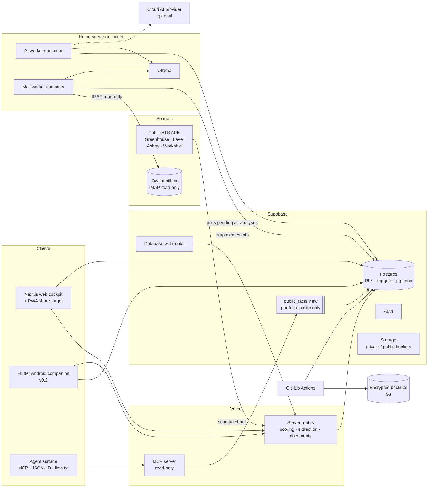

# CareerOps — Project Specification v1.2

**Personal career intelligence and execution system**

Status: architecture and implementation blueprint · Date: 2026-09-16 · Supersedes: v1.1 (2026-09-15), v1.0 (PDF)
Detailed contracts: [DOMAIN.md](DOMAIN.md) (entities, invariants) · [SCORING.md](SCORING.md) (formulas)

---

## 0. What changed

### 0.1 From v1.1 to v1.2

v1.1 modeled the career data well but scheduled the two capabilities that are the product — finding roles and producing targeted documents — behind the machinery that makes them smarter. Ads arrived only by paste, and the system had no surface that a machine could query. v1.2 corrects the order and adds a third client.

| Area | v1.1 | v1.2 | Why |
|---|---|---|---|
| Job intake | Paste and URL only; ATS adapters in v0.2 | **Three lanes in v0.1**: public ATS APIs, job-alert email in the user's own mailbox, paste/URL fallback (§7) | Paste is recording, not finding. Volume is the bottleneck, and the legal lanes deliver it. |
| Platform integration | Not modeled | Alert email is the **compliance layer** for platforms that forbid automated access; no credentialed access to any job platform (§7.2) | LinkedIn, Indeed and similar prohibit automation and enforce it. Reading one's own inbox does not. |
| Funnel events | Manual entry | Email ingestion proposes `opportunity_events`; the user confirms (§7.3) | Manual event logging stops within weeks, so O2 never gets its funnel data. |
| AI layer | v0.2, optional enhancement | **v0.1 carrier** for extraction, email triage and drafts; still fully optional at runtime (§9) | The deterministic core stays authoritative, but the useful paths now assume a provider exists. |
| Clients | Web cockpit, Android companion | Adds an **agent-facing surface** (§13): MCP server plus machine-readable public facts | The party searching is increasingly an agent. A document optimized for a human reader is not retrievable by one. |
| Outbound profiles | Not modeled | One source of truth generates every platform profile; the user pastes them (§13.4) | Consistency across platforms is what AI sourcing actually reads today. |
| Data classes | 4 | Adds `third_party_correspondence` (§10.1) | Recruiter mail is personal data belonging to other people and needs its own rule. |

### 0.2 From v1.0 to v1.1

v1.0 was reviewed against its own review brief (section 31) and against two further inputs: a professional positioning plan and market research on a shipped workforce product. The main changes:

| Area | v1.0 | v1.1 | Why |
|---|---|---|---|
| Career strategy | Job-ad driven only | **Job ads and company-first outreach** in one opportunity pipeline (employment, contract, consulting); organizations ranked by how directly they need what the candidate has already built | The strongest position is not "I am transitioning". It is "I have already built what you need." |
| Competitiveness | Not modeled | `project_benchmarks`: sourced, feature-by-feature comparison with commercial products, including honest gaps | Shows that the work competes with products companies pay for, in a form an interviewer can check. |
| Terms | Not modeled | Compensation floor per target role, expected and offered terms per opportunity, terms gate | Serious terms are a decision rule, not an afterthought. |
| Complex product experience | Seed row "Flutter, maintenance" | Product families, IP ownership, design decisions, **transferable practices** as skill kinds | Release engineering, device identity, offline sync and integration work transfer to Infra, Cloud, DevOps and Security roles. |
| Skills | User-scoped table with stored derived scores | Catalog (`skills`, aliases, 2-level hierarchy) separate from user state; derived values only in versioned snapshots | Jobs require skills the user does not track yet, and ads mix granularity. |
| Scoring | Multiplicative formulas, no required level, capability × confidence | Required level, noisy-OR confidence, additive gap priority, hard constraints as a separate gate | Explainable, tunable, and no double penalties. |
| Visibility | Enum on evidence | Ordered visibility plus a **disclosure ceiling** (employer or third-party approval), inherited from parents | Employer-owned and sensitive work needs a second authority. |
| Documents | Separate CV and portfolio engines | One document model: CV, cover letter, LinkedIn profile, case study, pitch, one-pager, integration brief, article | Same guardrails and freeze rule everywhere. |
| Schema | ~27 tables with duplicate paths | Duplicate paths removed; career history (employments, education, credentials, languages) added | CV guardrails need a canonical employment history. |
| n8n | Automation layer in MVP | **Removed from v0.1**; Postgres triggers, `pg_cron`, database webhooks and API routes | One less service to host, secure and back up, and core logic stays in code. |
| Local AI | Called from backend over Tailscale | **Pull-model worker** on the local machine consumes a queue | Vercel and Supabase functions are not on the tailnet. |
| Android | In v0.1 | **v0.2**; v0.1 gets a PWA share target for quick capture | Keeps v0.1 finishable; the companion follows once the data model is stable. |
| Public repository | Real seed data in `seed.sql` | **Public code, private data**: demo persona seed in the repo, real data only in Supabase and encrypted backups | The repository is portfolio evidence and must never leak career data. |

---

## 1. Summary

CareerOps is a private, single-user career operating system. It connects verified capabilities, project evidence, learning, target roles, real job requirements, target organizations, opportunities and career documents in one data model.

It continuously answers five questions:
1. Where am I now?
2. Where am I going?
3. What is missing?
4. What should I do next?
5. **Where is my proof worth the most, and on what terms?**

**Central principle: evidence over self-assessment.** A skill level is backed by releases, deployments, repositories, work history, incidents, labs and certifications. Learning has limited value until it produces evidence.

**Core success criterion.** Given a job ad *or* a target organization, CareerOps explains the fit, identifies high-value gaps, connects existing evidence, recommends the next practical work, and generates a truthful, targeted CV or pitch without inventing experience.

### 1.1 Product thesis

```
canonical profile → verified evidence → skill model → real market demand (ads + organizations)
→ explainable gaps → roadmap → projects and labs → stronger evidence
→ targeted documents → opportunities → outcome and terms feedback
```

The same verified facts feed three surfaces: the human reader (documents), the operator (cockpit and companion) and **the machine reader** (§13). A fact is written once, cleared for a visibility level once, and every surface is bound by that clearance.

If this loop works, automation is useful. If it does not, scraping, agents and visual polish only automate a weak model.

---

## 2. Principles

- **Single source of truth.** Supabase Postgres holds canonical career data for web, mobile, documents and portfolio.
- **Evidence first.** Claims are traceable to verified evidence.
- **Market-driven.** Priorities follow recurring requirements in real target jobs and the response of real organizations.
- **Proof is leverage.** Shipped products are modeled as reusable proof across tracks, not as one CV line.
- **Terms are explicit.** Every opportunity is checked against a floor before time is invested.
- **Deterministic core, optional AI.** The product works with AI disabled. AI suggests; the user confirms.
- **Human-controlled truth.** AI never silently changes factual career history.
- **Privacy by design.** Visibility is ordered (`private` < `cv_safe` < `portfolio_public`) and capped by third-party disclosure.
- **Public code, private data.** The repository is public; career data never enters it.
- **Action-oriented UI.** Dashboards drive the next 3–5 actions, not decorative analytics.
- **Progressive complexity.** Manual import and deterministic rules first; automation only after the model proves useful.

---

## 3. Positioning model

The goal is employment on serious terms, from the position of someone who has already built what the employer needs. The system is built around **proof-led positioning**.

1. **Proof first.** A shipped, complex product is decomposed into transferable practices, design decisions and a sourced competitive benchmark.
2. **Organizations by need.** Targets are ranked by how directly they need that proof:

| Employer tier | Description | Why the proof lands |
|---|---|---|
| **A: builds the same domain** | Vendors whose products include, or integrate from outside, the capability already built | The hiring manager recognizes the problem in the first minute |
| **B: same engineering problems** | Integrators and engineering organizations dealing with devices, identity, offline operation and enterprise integration | The proof transfers with one sentence of explanation |
| **C: operates the problem** | Enterprises whose internal IT runs the kind of system that was built | Relevant for matching vacancies only |

3. **Two positioning axes, one primary.** The primary axis is set by where the proof is strongest. The supporting axis (for example, long infrastructure and operations experience) differentiates within it and remains a separate track for job ads. Funnel metrics per axis (SCORING §9.1) confirm or correct the choice.
4. **Employment framing.** The candidate is hired for the ability to build and run such systems. Nothing in the outreach suggests selling a product. Product thinking such as pricing hypotheses or scope may be discussed as context.

Concrete target roles, weights, compensation floors and organization lists are **data** in the private instance, not part of this public specification.

---

## 4. Scope

### 4.1 v0.1: the first usable system

- Authentication (single user, sign-ups disabled, MFA) and profile
- Career history: employments, highlights, education, credentials, languages
- Skill catalog with aliases and hierarchy; user skill state and assessments
- Projects (product families, IP ownership, decisions, competitive benchmarks) and evidence with visibility and disclosure
- Target roles with compensation floors
- **Job intake on three lanes** (§7): public ATS APIs, job-alert email ingestion, paste or URL; deterministic requirement extraction, review queue for unmapped phrases
- Scoring snapshots: effective level, confidence, market frequency, job match with constraint gate, gap priority, readiness
- Organizations with need hypothesis, need signals and employer tier; contacts (including role hypotheses)
- Opportunities (job ad or outreach) with events, terms and terms gate
- **Email ingestion** (§7.3): read-only mailbox access, proposed opportunity events, user confirmation
- Documents from verified facts via templates: CV, LinkedIn profile, case study, pitch, one-pager, integration brief; frozen when sent
- **Agent-facing surface** (§13): `public_facts` projection, JSON-LD and `llms.txt` output, read-only MCP server over `portfolio_public` facts
- **Platform profile generation** (§13.4): one source of truth renders LinkedIn, Infostud, Joberty, Wellfound and GitHub profile text for manual pasting
- Roadmap items with evidence-based definition of done; tasks with focus selection
- Learning resources linked to skills
- PWA share target for quick capture of jobs, evidence and notes from a phone
- RLS on every table, audit log, encrypted backups with a tested restore

### 4.2 v0.2

- Flutter Android companion (§12)
- Cloud AI provider as an alternative to the local worker (§9)
- Public portfolio site and public demo instance
- Funnel dashboards per track
- `assess_fit` on the agent surface (§13.3), once scoring has enough real ads behind it

### 4.3 Later

- Browser extension or bookmarklet capture from logged-in job boards
- Recommendation beyond deterministic gap priority, once there is enough job and outcome data
- Offline-first mobile synchronization

### 4.4 Non-goals

- Multi-user SaaS or team features
- Automatic application or outreach submission
- Mass scraping or LinkedIn automation
- **Credentialed or automated access to any job platform**: no stored platform passwords or session cookies, no headless browser acting as the user, no automated profile edits or connection requests (§7.2)
- **Unsolicited push to third-party agents**: the agent surface answers when called and never injects itself into someone else's system (§13.5)
- Gamification
- AI-generated claims that cannot be traced to verified facts
- Storing operational details of restricted employment, even as private data

---

## 5. Architecture



Three properties hold across the diagram. Every inbound lane writes into one `jobs` table with the same dedupe rule. The mail worker runs on the tailnet, not on Vercel, because correspondence must not leave the local boundary by default. The MCP server reads `public_facts` and nothing else, so it cannot reach private rows even if compromised.

### 5.1 Technology baseline

| Layer | Technology | Note |
|---|---|---|
| Web | Next.js + TypeScript, Tailwind, shadcn/ui | Cockpit and server routes |
| Backend | Supabase (Postgres, Auth, Storage, RLS, webhooks, `pg_cron`) | EU region |
| Domain logic | `packages/scoring`, `packages/extraction`, `packages/documents` (TypeScript, pure) | Single implementation of business rules |
| Mobile | Flutter (v0.2) | Reads snapshots; mutations that need recomputation go through API routes |
| AI | Provider interface; local worker with Ollama over Tailscale; optional cloud provider | Never a hard dependency |
| Job intake | `packages/intake`: ATS API clients, mail parsers, normalizer | One `jobs` shape from every lane |
| Mail | `services/mail-worker`: IMAP read-only, runs on the tailnet | Correspondence is processed locally by default |
| Agent surface | `services/mcp`: read-only MCP server over `public_facts`; JSON-LD and `llms.txt` generated at build time | No write tools, no private reads |
| Hosting | Vercel + Supabase | Low operational burden |
| Infrastructure as code | Terraform (Vercel, Supabase and AWS providers) | Environments, backup bucket, IAM |
| CI/CD | GitHub Actions with OIDC to AWS | No long-lived cloud keys |

### 5.2 Where rules live

| Rule type | Location |
|---|---|
| Integrity, ownership, visibility ceiling, freeze rules, append-only logs | Postgres constraints, triggers, RLS |
| Scoring, extraction, document assembly | TypeScript packages, unit-tested, versioned |
| Orchestration (recompute on change, nightly jobs, follow-up reminders) | Database webhooks, `pg_cron`, API routes |
| Presentation | Clients only |

**Contracts between web and mobile.** The database schema is the contract. TypeScript types come from `supabase gen types`; Dart models are generated from the PostgREST OpenAPI description. Business logic is never ported to Dart. Mobile reads stored results.

---

## 6. Core flows

### 6.1 Evidence

```
capture (web, share target, later mobile)
→ classify type and parent (project, employment, learning)
→ map to skills with strength and demonstrated level (manual, rule or AI suggestion)
→ user verifies the fact and confirms each mapping
→ eligible for scoring
→ optionally raise visibility, up to the disclosure ceiling
```

### 6.2 Job ad

```
paste or URL
→ store raw text, hashes, dedupe
→ deterministic extraction via alias dictionary (skills, levels, constraints)
→ review queue for unmapped phrases (creates aliases or catalog skills)
→ job match snapshot with constraint gate
→ market frequency and gap priority update
→ opportunity (origin = job_ad) if worth pursuing
```

### 6.3 Company-first outreach

```
organization research (products, known integrations, open roles, sources, date)
→ need hypothesis + employer tier: what do they need that already exists?
→ opportunity: angle, fit, receptiveness, proof project, contacts or role hypotheses
→ terms gate against the target role floor
→ company-specific paragraph + pitch or one-pager, from verified cv_safe facts and benchmark rows
→ document versions frozen on send
→ events: messages, calls, interviews, demo, offer
→ outcome and terms feed funnel metrics per axis and origin
```

A company-specific paragraph is mandatory for outreach documents. Sending the same letter to many organizations throws away most of the advantage that specific proof provides.

Research claims about organizations (headcounts, products, vendors used, open roles) are dated and sourced, and they are re-checked before outreach. The system does not treat third-party research as fact.

### 6.4 Documents

```
target (role, job, organization or project)
→ select verified facts meeting the kind's visibility minimum
→ template assembly (v0.1), AI-assisted wording (v0.2) with per-sentence source references
→ user review
→ freeze on send
```

### 6.5 Roadmap

```
high-value gaps and `prove` gaps
→ roadmap item with evidence-producing definition of done
→ tasks, with 3–5 selected as focus
→ evidence linked
→ item can be marked done (invariant I7)
```

---

## 7. Job ingestion

Volume is the constraint the pipeline exists to relieve. Intake therefore runs on three lanes that all normalize into one `jobs` table, deduplicated on `url_hash` and normalized `content_hash`.

### 7.1 The three lanes

| Lane | Mechanism | Coverage | Status |
|---|---|---|---|
| **A · ATS APIs** | Scheduled pull from public job-board endpoints of Greenhouse, Lever, Ashby and Workable, per tracked organization | Where postings originate; structured and reliable | v0.1, primary |
| **B · Alert email** | Job-alert messages delivered to the user's own mailbox, parsed per sender template | LinkedIn, Indeed, Infostud, HelloWorld, Joberty and any board offering alerts | v0.1, primary |
| **C · Paste or URL** | Manual paste, server-side fetch with readability extraction, PWA share target | Anything the first two miss | v0.1, fallback |

Lane A is pulled per organization, so it stays inside `organizations` and never becomes a crawler. Lane C tries one server-side fetch; on a dynamic page, a block or a login wall it asks for a paste. No crawling, no retries against blocks.

### 7.2 Why email is the compliance layer

The major job platforms prohibit automated access in their terms of use and enforce it against accounts. CareerOps therefore holds **no platform credentials, no session cookies and no headless browser** (§4.4), and does not read those platforms directly.

It reads the user's own mailbox instead. Alert email is content the platform chose to send to its recipient, and processing one's own correspondence needs no permission from the platform. The coverage is nearly identical to what direct access would give, because alerts are generated from the same postings. The lane is legitimate, durable and cannot get an account suspended.

This is a deliberate trade: less structure than an API, in exchange for reaching the platforms that matter without violating their terms or risking the user's most valuable channel.

### 7.3 What email ingestion may do

The mail worker runs on the tailnet with **read-only** IMAP scope. It classifies each message into one of three kinds and never sends, replies, deletes or marks anything.

| Kind | Extracted | Written |
|---|---|---|
| Job alert | Postings inside the message | `jobs` rows via the normalizer |
| Recruiter or process mail | Organization, role, stage, stated terms, requested action | A **proposed** `opportunity_event`, `status = suggested` |
| Everything else | Nothing | Ignored and not stored |

Proposals require user confirmation before they affect the pipeline, funnel metrics or any document. The worker suggests; the operator decides. Message bodies are processed locally through Ollama by default and a cloud provider is used only if the user turns it on for this class explicitly (§10.1).

### 7.4 Corpus first

Start collecting real target ads from week one, even as raw text, before any extraction code exists. By the time extraction lands there should be 20–30 real fixtures, and market analysis needs them anyway. This is the one intake activity with no engineering prerequisite, and phase 0 does not exit without it.

---

## 8. Document guardrails

- Never invent employers, dates, titles, responsibilities, certifications, metrics, customers or scale.
- Only verified facts at or above the kind's visibility minimum (DOMAIN I4).
- Every generated sentence keeps source references; a validator rejects numbers, dates and proper names not present in the sources.
- Versions freeze when sent; each opportunity records exactly which versions were sent.
- Third-party estimates (market sizing, valuations, replacement cost, hiring probabilities) are context for decisions and are never presented as facts about the candidate's work.
- Competitive comparisons come only from `project_benchmarks` rows with verified own evidence and a recently checked source (DOMAIN I12). Rows marked `absent` stay visible to the user so that claims do not drift into "better than" without proof.
- The origin of the work (employer, client or independent) is stated as recorded in `projects.ip_owner`, never upgraded to "independent" for convenience.
- Restricted employment appears only as its stored abstraction.

---

## 9. AI and agent layer

Promoted from v0.2 to v0.1. The deterministic core (§9.3) remains authoritative and the product still works with every provider disabled, but the paths that create daily value — extraction from messy ad text, mail triage, document wording — now assume a provider is normally present.

### 9.1 Interface

```ts
interface AIProvider {
  extractJobRequirements(input: JobText): Promise<RequirementSuggestion[]>;
  suggestAliases(input: UnmappedPhrase[]): Promise<AliasSuggestion[]>;
  suggestEvidenceMappings(input: EvidenceSummary): Promise<MappingSuggestion[]>;
  draftHighlights(input: VerifiedFacts): Promise<DraftWithSources>;
  explainScore(input: ScoreBreakdown): Promise<string>;
  classifyMessage(input: MailText): Promise<MailClassification>;
  proposeReply(input: MailThread & VerifiedFacts): Promise<DraftWithSources>;
}
```

All outputs are validated against JSON schemas and the skill catalog before they are shown. `proposeReply` returns a draft only; nothing in the system sends mail (§4.4).

### 9.2 Local worker (pull model)

Vercel and Supabase functions cannot reach a Tailscale network. The server writes `ai_analyses` rows with `status = pending` and ids-only `input_refs`. A container on the home server:

1. authenticates as a dedicated database role granted only `ai_context_*` views and `ai_analyses`
2. claims a job
3. builds context from those views, which exclude `ai_allowed = false` rows
4. calls Ollama
5. writes the output and latency

It never holds a service-role key.

The **mail worker** is a second container on the same tailnet with the same shape and a narrower grant: read-only IMAP outward, and inward only the right to insert `jobs` and `suggested` opportunity events. It holds no service-role key and cannot read career data beyond what a proposal needs for matching.

### 9.3 Stays deterministic

Alias matching, scoring, gap priority, market frequency, visibility filtering, fact selection for documents, funnel metrics and reminders.

### 9.4 May use an LLM

Requirement extraction from messy text (after dictionary pass), alias suggestions, evidence mapping suggestions, wording drafts with sources, plain-language explanations of breakdowns, mail classification and reply drafts.

### 9.5 Never

No provider may send a message, submit an application, change a platform profile, alter factual career history, mark evidence verified, or emit a claim without a source reference that survives the §8 validator. These are enforced at the boundary, not by prompt instruction, because a prompt is not a control.

---

## 10. Security and privacy

### 10.1 Data classification

| Class | Examples | Handling |
|---|---|---|
| Restricted source | Operational details of sensitive employment | **Never stored.** Only the abstraction is written. |
| Third-party correspondence | Recruiter and hiring-manager email: names, addresses, signatures, message bodies | Local processing by default; extracted fields kept, raw bodies retained 90 days then purged; never rendered into any public surface or document; never sent to a cloud provider unless explicitly enabled for this class |
| Private | Contacts, terms, organization research, unverified evidence, private evidence files | RLS; private bucket; excluded from AI unless `ai_allowed` |
| Professional (`cv_safe`) | CV-grade highlights, approved project summaries | Documents sent to organizations |
| Public (`portfolio_public`) | Approved case studies, articles, public repositories | Statically generated portfolio **and the agent surface (§13)** |

Third-party correspondence is the only class describing people who are not the user and who never agreed to be in this system. It is therefore minimized on intake: the worker keeps the fields a pipeline event needs and discards the rest, rather than archiving mailboxes.

### 10.2 Controls

- Supabase Auth with **sign-ups disabled** and MFA on the single account.
- RLS on every table (`user_id = auth.uid()`); RLS tests in CI.
- Service-role key only in server environments, never in `NEXT_PUBLIC_*` or the mobile app.
- Separate storage buckets for private evidence and public assets; signed URLs for private files.
- Portfolio pages generated server-side from a constrained view; no anonymous table access.
- `audit_log`, `skill_assessments` and frozen document versions are append-only.
- Secret scanning (gitleaks) and dependency review in CI; environment templates only in git.
- EU region for the database.

### 10.3 Public repository, private data

| In the public repository | Never in the repository |
|---|---|
| Code, migrations, RLS tests, Terraform, CI | Real seed data, exports, backups |
| `supabase/seed/demo.sql`: a fictional persona | Organization research, contacts, terms |
| Documentation, ADRs, threat model | Source PDFs and research reports (`private/`, git-ignored) |
| Screenshots of the demo instance | Screenshots of the real instance |

The **public demo instance** runs on a separate Supabase project with the demo seed. A reviewer can click through the full system without any real data.

---

## 11. Web cockpit

| Route | Function |
|---|---|
| `/dashboard` | Target role readiness, top 3–5 gaps, focus tasks, opportunities needing action, evidence awaiting verification |
| `/history` | Employments, highlights, education, credentials, languages |
| `/skills`, `/skills/[id]` | Skill matrix; assessment history, evidence, confidence breakdown, demand, next action |
| `/evidence` | Inbox, verification, mapping confirmation, visibility |
| `/projects`, `/projects/[id]` | Product families, decisions, evidence, disclosure and IP status |
| `/jobs`, `/jobs/[id]` | Import, extraction review, match with constraint gate, market view |
| `/organizations`, `/organizations/[id]` | Research, contacts, related jobs and opportunities |
| `/opportunities` | Pipeline across tracks, terms gate, follow-ups, funnel per track |
| `/documents` | CV, LinkedIn, case studies, pitches, briefs; versions and sources |
| `/roadmap` | 90-day, 6-month and target horizons; milestones and tasks |
| `/learning` | Resources tied to active gaps |
| `/settings` | Target roles and floors, scoring config, AI provider, integrations |

Dashboard order: readiness → gaps → focus actions → opportunities → evidence to verify → learning (only if tied to a current roadmap item).

---

## 12. Android companion (v0.2)

Deliberately small, three tabs:

| Tab | Purpose |
|---|---|
| **Today** | Focus tasks, opportunity follow-ups due, readiness headline |
| **Capture** | Share intent and "+" for job, evidence note, organization, task; drafts queued locally when offline |
| **Pipeline** | Opportunities and jobs with match summary and stage changes |

Notifications cover the selected task, follow-ups due, interviews and deadlines. No motivational notifications. Full editing stays on the web.

---

## 13. Agent-facing surface

### 13.1 Why

Sourcing increasingly runs through software rather than a person reading a document. A CV is optimized for a human eye and an ATS keyword match; neither makes the underlying facts *queryable*. The same verified facts that produce a CV can be exposed in a form a machine can retrieve, filter and cite.

This surface is built on an honest premise: **almost nobody sources candidates over MCP today.** It is not justified by expected inbound traffic. It is justified because the user's own agent needs a grounded source of truth about them, because machine-readable public facts are what retrieval-based search actually reads, and because building it is itself evidence of the integration skills the target roles ask for. If it ever becomes a sourcing channel, the surface is already there.

### 13.2 What is exposed

Only `portfolio_public` facts, through a dedicated `public_facts` view. The existing visibility ordering and disclosure ceiling (DOMAIN §5) are the access control; this section adds no new clearance mechanism and no exception to the old one. A fact that is not cleared for the public portfolio is not reachable here, by any tool, in any mode.

| Output | Form | Refresh |
|---|---|---|
| Structured profile | JSON-LD `Person` with `knowsAbout`, `hasCredential`, `subjectOf` | Build time |
| Crawler map | `llms.txt` and sitemap pointing at curated markdown | Build time |
| Queryable interface | MCP server (§13.3) | Live, read-only |

### 13.3 MCP tools

| Tool | Returns | Availability |
|---|---|---|
| `search_evidence(skill, min_level?)` | Public evidence for a capability, each row with `source_ref` | v0.1 |
| `get_project(id)` | Public project summary: problem, decisions, stack, `ip_owner`, verified links | v0.1 |
| `list_capabilities()` | Public skills with effective level and confidence band | v0.1 |
| `assess_fit(job_text)` | Match summary, honest gaps, relevant evidence | v0.2, after §7 has real ads behind the scoring |

Every tool is read-only. There are no write tools, no contact tools and no tool that reveals terms, floors, contacts, organization research or pipeline state.

### 13.4 Platform profile generation

Direct platform automation is excluded (§4.4, §7.2), so the outbound path is generation, not posting. From one source of truth the system renders profile text per destination — LinkedIn headline and About, Infostud, Joberty, Wellfound, GitHub bio — through the same §8 guardrails as any document. The user pastes it.

The value is consistency: five profiles saying the same true thing, updated together, is a stronger and more retrievable signal for AI-assisted sourcing than a queryable endpoint nobody calls yet.

### 13.5 Guardrails

The agent surface is an untrusted input boundary in both directions.

- **Injection.** `job_text` and every other free-text argument is data, never instruction. Tool output passes the §8 source validator unchanged: any number, date or proper name absent from the sources is rejected before it leaves the process. A caller cannot talk the surface into a claim the documents would refuse to make.
- **Pull only.** The surface answers when called. It never posts, messages, registers itself or injects into another party's system (§4.4).
- **Rate and disclosure.** Anonymous reads are rate-limited per address and logged to `audit_log` with the tool name and argument hash, never the raw argument. Volume is observable without retaining what strangers typed.
- **No inference about people.** The surface answers about the user only. It does not accept, store or reason about third parties supplied by a caller.

---

## 14. Repository structure

```
careerops/
├── apps/
│   ├── web/                    Next.js cockpit, API routes, PWA
│   └── mobile/                 Flutter companion (v0.2)
├── packages/
│   ├── scoring/                pure TS, SCORING_VERSION, golden tests
│   ├── extraction/             alias dictionary, requirement parser, fixtures
│   ├── intake/                 ATS clients, mail parsers, jobs normalizer
│   ├── documents/              fact selection, templates, source validator
│   └── ai/                     provider interface and schemas
├── services/
│   ├── ai-worker/              Dockerfile, pull-queue worker
│   ├── mail-worker/            Dockerfile, IMAP read-only, proposal writer
│   └── mcp/                    read-only MCP server over public_facts
├── supabase/
│   ├── migrations/
│   ├── tests/                  pgTAP RLS and invariant tests
│   └── seed/demo.sql           fictional persona only
├── infra/
│   └── terraform/              vercel, supabase, aws (backup bucket, OIDC role)
├── docs/
│   ├── SPECIFICATION.md  DOMAIN.md  SCORING.md
│   ├── ENVIRONMENTS.md  OPERATIONS.md  THREAT_MODEL.md (phase 6)
│   └── adr/
├── .github/workflows/          ci, security, scorecard, pr-policy, release-please;
│                               db, deploy-staging, deploy-production, backup, restore-drill (later phases)
└── private/                    git-ignored: real seed, source documents, research
```

pnpm workspaces and Turborepo for the TypeScript side; Flutter is managed with its own toolchain inside the same repository.

---

## 15. The repository as professional evidence

CareerOps is itself evidence for the target roles. Each engineering practice below is real, inspectable and linked to the matching skill in the system.

| Practice in the repository | Evidence for |
|---|---|
| Terraform for Vercel, Supabase and AWS; remote state | Infrastructure as Code |
| GitHub Actions: lint, typecheck, unit, pgTAP, migration replay, gitleaks, deploy | CI/CD |
| OIDC from GitHub to AWS with a least-privilege role | Cloud IAM, security |
| RLS with tests, visibility ceiling triggers, threat model | Application and data security |
| Nightly encrypted `pg_dump` and storage sync to S3; monthly automated restore drill | Backup, recovery, operations |
| Containerized AI worker on a tailnet with a scoped database role | Docker, networking, zero-trust access |
| Read-only MCP server with injection guardrails and a source validator on the output path | AI integration, agent-facing API design, secure tool boundaries |
| Third-party ATS API clients and mail parsers normalizing into one schema | Integration engineering, data normalization |
| Compliance-driven intake design: no credentialed platform access, documented in an ADR | Engineering judgment under legal constraint |
| Structured logs, error tracking, AI latency metrics | Observability |
| ADRs and versioned scoring | Architecture communication |
| Public demo instance with a fictional persona | Delivery, privacy by design |

---

## 16. Testing (highest return first)

1. **RLS and invariants** (pgTAP): another user and anon see nothing; visibility ceiling; freeze rules; I12.
2. **Scoring golden tests and property tests** (SCORING §12).
3. **Extraction fixtures** from 20–30 real ads, stored privately and sanitized copies published.
4. **Document guardrail tests**: private, unverified or unsourced facts never reach output.
5. **Migration replay** from zero in CI (`supabase db reset`).
6. **Restore drill**: a backup restores into a fresh local stack and the smoke query passes.
7. One web smoke test per critical flow. Widget and extensive end-to-end tests come later.

---

## 17. Operations

- **Migrations** only through the Supabase CLI in git; no dashboard schema edits; drift check in CI.
- **Backups**: nightly encrypted database dump plus storage sync; retention 30 daily and 12 monthly; restore drill monthly. Free-tier projects pause when inactive and have no point-in-time recovery, so the backup job also keeps the project active and checks health.
- **Portable export**: a JSON and Markdown export of canonical career data, so the data outlives the application.
- **Observability**: structured logs for extraction, scoring and AI failures; error tracking for web and mobile; AI latency and error rates from `ai_analyses`.
- **Dependencies**: grouped update PRs reviewed intentionally.

---

## 18. Implementation phases

| Phase | Deliverable | Exit criterion |
|---|---|---|
| 0 · Foundation | Repository, docs, ADRs, CI skeleton with gitleaks; **job ad corpus collection starts** | Domain agreed; CI green; **20+ real ads collected as raw text** |
| 1 · Data | Migrations, RLS, invariant triggers, pgTAP tests, demo seed, private seed | Real career data stored safely; tests prove isolation and ceilings |
| 2 · Thin loop | Minimal career history and projects; paste intake; template CV and pitch with the §8 validator; opportunities with events | **One real application goes out of the system, end to end, with a frozen document** |
| 3 · Intake at volume | ATS API clients, mail worker, normalizer, dedupe, extraction, review queue | Ads arrive without manual entry; 50+ ads in the corpus from lanes A and B |
| 4 · Proof and scoring | Full skills, evidence and benchmarks; scoring snapshots | DOMAIN §8 represented; ads produce explainable matches and ranked gaps |
| 5 · Organizations and outreach | Organizations, need hypotheses, employer tier, terms gate, company-specific documents | Outreach runs from the system with funnel data per track |
| 6 · Agent surface | `public_facts`, JSON-LD, `llms.txt`, MCP server, platform profile generation | A third-party agent can query public evidence; profiles regenerate from one source |
| 7 · Execution | Roadmap, tasks, learning | Gaps turn into evidence-producing work |
| 8 · Platform | Terraform, OIDC, backups, restore drill, observability, threat model | The system is recoverable, and the repository stands as DevOps evidence |
| 9 · Companion and public | Flutter Android app, demo instance, portfolio site | Capture works from the phone; a reviewer explores the system without real data |

**Phase 2 is the change that matters.** In v1.1 the first real career output arrived in phase 4, behind the data model, the proof model and the market model. It now arrives second, on a deliberately thin slice: a CV can be tailored from a career-history table without a scoring engine. Scoring makes the output smarter; it is not what makes it work. Everything after phase 2 improves a loop that already runs.

Phase 3 comes before scoring because scoring is worthless without a corpus, and phase 6 comes after documents because the agent surface exposes the same facts the documents already clear. Phases 5 and 8 can overlap.

Every phase must produce a career output. A phase that produces only internal machinery is a phase that has drifted.

---

## 19. Definition of done for v0.1

- The real profile and career history are seeded, editable and verified.
- 20–30 meaningful skills, including transferable practices, have assessed and target levels.
- Major projects, including at least one complex product family, are mapped to evidence with verified links.
- Visibility and disclosure ceilings are enforced and tested.
- At least 50 real target ads are imported, the majority through lanes A and B without manual entry.
- At least 5 organizations are researched, with opportunities carrying angle, fit and terms.
- Targeted CV, LinkedIn profile and pitch documents are generated from verified facts only, and frozen on send.
- **At least 10 real applications or outreach messages have left the system**, each with a frozen document version and recorded events.
- Email ingestion proposes opportunity events, and no proposal has ever changed the pipeline without confirmation.
- The agent surface answers `search_evidence`, `get_project` and `list_capabilities` over public facts only, and an injection attempt against it fails the source validator in a test.
- A 90-day roadmap exists as tasks with evidence-based definitions of done.
- The core product works with AI disabled.
- RLS, backup and a restore drill are verified.
- CI passes; deployment is reproducible from Terraform and migrations.

---

## 20. Risks and countermeasures

| Risk | Countermeasure |
|---|---|
| Over-engineering before usefulness | Narrow v0.1, phase exit criteria, opportunities early |
| Unfinished project | Every phase produces a career output |
| Subjective skill inflation | Unsupported part of a claim is half-credited; confidence is always visible |
| AI-invented claims | Verified facts only, source validator, freeze on send |
| Leaking sensitive or employer information | Restricted data never stored, disclosure ceilings, public-code-private-data split |
| Misstating the origin or rights of owner-controlled work | `ip_owner` and disclosure recorded per project; code, metrics and customers need approval |
| Overstating competitiveness | Benchmark rows require verified evidence and sources; honest gaps are kept |
| Being perceived as selling a product rather than seeking a job | Employment framing in all outreach documents; product thinking only as context |
| Stale third-party research | Dated, sourced organization records; re-check before outreach |
| Diluted positioning | One track per document; funnel metrics decide the primary axis |
| Accepting weak terms under pressure | Floor per target role, terms gate before contact |
| Noisy job corpus | Target role filters, relevance rating, minimum sample |
| Local AI unavailable | AI optional; queue simply waits |
| Opaque scoring | Versioned formulas, visible breakdowns, golden tests |
| **Platform terms violation or account suspension** | No credentialed or automated platform access (§4.4); intake through public APIs and the user's own mailbox (§7.2); recorded in ADR-0015 |
| **Third-party personal data in recruiter mail** | Own data class (§10.1), local processing by default, field minimization on intake, 90-day raw-body purge, never rendered into public surfaces |
| **Prompt injection through the agent surface** | Free-text arguments treated as data; §8 source validator applied to tool output; read-only tools; no third-party inference (§13.5) |
| **Agent surface mistaken for a sourcing channel** | Justified as own-agent grounding and portfolio evidence (§13.1), not by expected inbound traffic; consistent platform profiles (§13.4) carry the discovery load |
| **Automation drifts into acting for the user** | No provider may send, submit or edit a profile (§9.5); enforced at the boundary, not by prompt |

---

## 21. Decisions and remaining input

| # | Decision | Resolution | Rationale |
|---|---|---|---|
| O1 | Rights to present the shipped product | The owner controls the repository and signing keys. Architecture, decisions, own role and a sanitized showcase repository may be public. Before labeling the work "independent", the IP clause of the employment or engagement contract is checked and the result recorded in `projects.ip_owner`. Customer data and customer names are never shown. | Unblocks a public showcase without overstating legal ownership |
| O2 | Primary positioning axis | **Proof-led: integration and edge systems**, with infrastructure and operations as the differentiating supporting axis; reviewed on funnel data after 8 weeks | The goal is to be hired as someone who has already built what the employer needs |
| O3 | Compensation floors | **Resolved by O9** (2026-09-16); the terms gate no longer reports `unknown` | Numbers cannot be derived from documents; they needed owner input |
| O4 | Product names in public documentation | Product names allowed (already public through store listings and professional profile); employer names stay out of the public repository | Showcase value without exposing employer relationships |
| O5 | Android companion timing | v0.2 as proposed | Mobile delivery is already proven by the shipped product; v0.1 must produce career outcomes first |
| O6 | Job platform integration | **No credentialed or automated access.** Intake through public ATS APIs and the user's own mailbox. | The platforms prohibit automation and enforce it; the compliant lane reaches the same postings (ADR-0015) |
| O7 | Agent surface scope | **Read-only over `portfolio_public` facts**, pull only, no write or contact tools | Justified as agent grounding and portfolio evidence, not as a traffic channel (ADR-0014) |
| O8 | Mail processing location | **Local worker on the tailnet by default**; cloud provider only if explicitly enabled for `third_party_correspondence` | Correspondence contains other people's personal data |
| O9 | Compensation floor | **3.000 € / month** at 20–25 h/week; a full-time engagement is evaluated at the same effective rate, not the same monthly figure | Owner input, 2026-09-16; resolves the `unknown` state O3 left in the terms gate |

Decisions are recorded as ADRs in `docs/adr/`.
